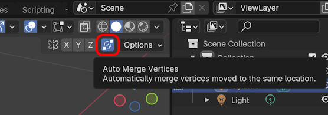
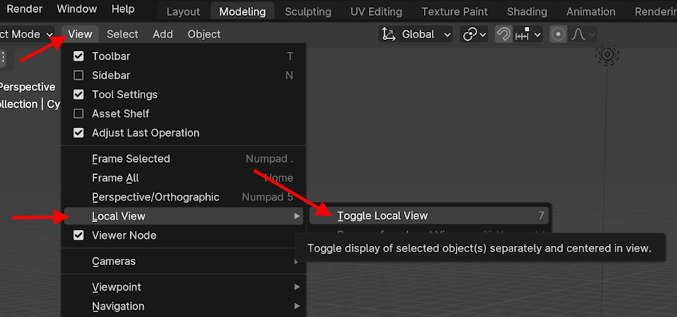

* Press the Auto-Merge Vertices button: 

* `S` to scale, then pres `0` to scale to zero and close the top of our mushroom

> Since we have auto merge vertices enabled, this will form a singular vertex at the top of our mushroom.

<!--
# Local View

* From the `View` menu, choose `Local View` and then `Toggle Local View` to zoom in on your newly created cylinder

> This is also very handy if you create multiple objects in one Blender document and want to edit them one by one.
>
> Having a shortcut for this is very handy. The default is the `Numpad /` key. If you don't have a numpad, you can set a different *Key binding* from the `Preferences`, `Keymap` menu. I'm using `7` on my keyboard.

-->
