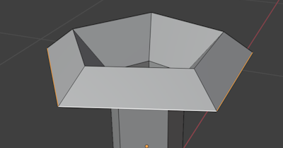
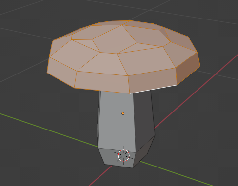
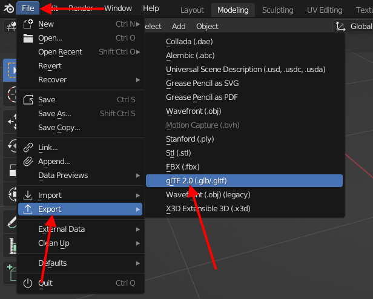

# A Low-Poly Mushroom

In this guide we'll make a low-poly mushroom like this:

* Start Blender

<!--
* Switch to the `Modeling` workspace (at the top of the screen)

-->

* Select the default Cube
* Press `X`, then `Enter` to delete the Cube

# Add a Cylinder

* Press `Shift+A` to open the **Add** menu

* Choose `Mesh` then `Cylinder`

<!--
> _Alternatively_ use the button on the toolbar:
>
> 
-->

* In the `Add Cylinder` options (bottom left corner), set the following:
  * Vertices: 5
  * Radius: 0.1m
  * Depth: 0.4m
  * Cap Fill Type: None
  * Z: 0.2m

It will be rather small, but should look something like this:

> Since we're going for a low-poly look, 5 is a good start here. But even for a high-poly design this is not a bad starting value since we can add more polygons later with _modifiers_.
>
> Also, for the initial size (Radius, Depth), we're just going for something that's smaller than a typical character (1-2m tall).

# Frame Selected

* From the `View` menu, choose `Frame Selected` to zoom in on your newly created cylinder

* You may want to zoom out a bit. _Use the `Mouse Wheel` on Windows or `Cmd+Two Finger drag` on Mac._

<!--
> Having a shortcut for this is very handy. The default is the `Numpad .` key. If you don't have a numpad, you can set a different *Key binding* from the `Preferences`, `Keymap` menu. I'm using `F` on my keyboard.
-->

# Edit Mode

* Press the `Tab` key to enter **Edit Mode**, or use the `Interaction Mode` switcher:

* Press the `2` key to switch to `Edge Selection Mode`

# Extrude and Scale

We'll now build the basic shape of our mushroom.

Don't worry if it don't turn exactly right on the first try. We'll tweak the shape later.

* `Alt + Left-Click` on one of the top edges on your cylinder:

* Press `E` to start extruding
* Move your mouse up a bit <!-- -->
* Press `Z` to restrict extrusion to the Z axis (up/down)
* `Left-Click` when you have something like this:

* Press `S` to scale, and make the loop larger
* `Left-Click` when you have something like this:

* Press `E`, then `Z` to extrude along Z again
* This time, move *down* a bit
* `Left-Click` when you have something like this:

* `S` to scale again:
* `Left-Click` when you have something like this:

* Repeat **Extruding** and **Scaling** 4 times to get something like this:

> Avoid creating too many steps. In Blender, it's generally an advantage to start out with as little geometry as possible, and the add details later.

# Closing the Top

* Press `M` to Merge vertices
* Choose `At Center`:

We now have a very coarse mushroom:

# Tweaking the Shape

Rotate the view around and check that the shape of the mushroom is like you want it. If it's not quite right, you can:

* `Alt + Click` edges to select loops on the mushroom, then
* `S`, `Move mouse`, `Left-Click` to **scale** the selected loops
* `G`, `Z`, `Move mouse`, `Left-Click` to **move** the selected loops up and down (in Z)

Repeat scaling and moving until you're happy with the shape.

# Closing the Bottom

Notice that the bottom of our mushroom is still open.

Let's fix that.

* Select the bottom edge loop (`Alt + Left-Click`)
* Press `F` to form a new *Face* from the loop

# Better Stem

Now that we're on the bottom, let's make the stem a little less straight.

* Press `Ctrl+R` to add a *Ring Cut*
* Move the mouse over the stem
* `Left-Click`
* Move the ring towards the bottom of the stem
* `Left-Click` when you have something like this:

* `S`, `Move mouse`, `Left-Click` to scale the ring outwards a bit

# More Details

Now, let's add a bit more detail. While 5 segments are OK for the stem, the "hat" of the mushroom is probably a bit too pointy.

* Press `Alt + Z` to toggle "X-ray" mode, or use the button in the toolbar:

* Select the edges like shown below. There's a couple of options:
  * While **holding `Shift`**, `Left-Click` each edge
  * While **holding `Shift`**, `Click and drag` around the edges
  * Select the edges for one corner, then press `Shift+G` and choose `Face Angles` to select _similar_ edges. 

* Press `Alt + Z` to toggle "X-ray" mode off again
* Press `Ctrl + B` to start the Bevel command
* Move the mouse to get a good sized bevel
* `Left-Click` when you have something like this:

* Check the bottom of your mushroom. If it doesn't look good, Undo (Ctrl+Z) a few times and try a different size bevel, or try beveling a different set of edges. It doesn't have to look exactly like mine.

# More details

Blender has a nice way to add details to any Mesh using Modifiers.

* Click the `Modifiers` button  on the bottom-right panel:

* Click `Add Modifier`
* Choose `Subdivision Surface` under `Generate`:

Notice how the mushroom preview is now more detailed:

Having the subdivision shown while editing can get a little annoying, but fortunately Blender allows this to be customized.

* Click the  button to turn off subdivision preview during editing.

* Press `Tab` to switch to **Object Mode**
* Press `Tab` again to switch back to **Edit Mode**

Notice how the preview changes.

Using a subdivision modifier like this allows us to keep modeling with simple geometry while having more details for preview and (later) rendering and export.

# Coloring

Ok. Time for some color.

* Press `3` to switch to `Face
* Select one part of the Mushroom "hat" like this:

You may also want to include faces from the underside of the "hat".

* Press `Shift+G` and choose `Area` to select the entire hat

> If you don't get exactly the right set of faces you may want to lower the `Select Similar` `Threshold`:
> 
> 

You'll want a selection like this:

* Go to the `Materials` panel by clicking the  button

* Press the `New` button

* Click the colored field for `Base Color`:

* Choose any color you'd like for the hat
* Press the `Assign` button

You'll notice that the preview doesn't change. That's because we're in `Solid` viewport shading mode.

* Click the  button in the top-right corner:

* _Alternatively:_ Press `Z`, then select `Material Preview`

Your mushroom should now show in the color you've chosen. But since there's only one material it'll be used for the entire mushroom, despite our current selection. Let's fix that but adding a second material for the stem.

* Create another material by pressing the `+` button
* Press the `New` button
* Pick a `Base Color` suitable for the stem
* Press `Ctrl+I` to invert the selection, so the stem is selected
* Press the `Assign` button
* Press `Tab` to switch back to *Object Mode* preview:

# Saving

If you haven't already done this, now would be a very good time to save your Blender file.

* Press `Ctrl+S` to save

If this is the first save, Blender will ask for a name and location

# Exporting

To use your Mushroom in another application like Godot, you'll need to _export_ it.

* From the `File` menu, choose `Export`, then `glTF 2.0 (.glb/.gltf)`:

* Navigate to a suitable location for your exported file
* Expand `Include`
* Enable `Export Selected` (assuming you've still got your Mushroom selected)
* Expand `Geometry` and `Mesh`
* Enable `Apply Modifiers`
* Type a name of your liking in the name field

* Press `Export glTF 2.0`
* Enjoy your **glTF** file

# Variety

* Make sure you're in *Object Mode*
* Press `Shift+D` to create a copy of the mushroom
* Press `Shift+Z` to restrict movement to the floor (`XY` plane)
* Move the mouse to move the copy a bit away from the original
* `Left-Click` to place the copy
* Press `Tab` with your copy selected to edit it

Use the following tools to make your copy slightly different.

Select things:

* Use keys `1`, `2` and `3` to make changes to vertices, edges and faces respectively
* Make individual selections by `Left-clicking`, `Holding Shift` to select multiple vertices/edges/faces
* `Left-Click and Drag` to make a box selection
* Use `Shift+G` to select similar vertices/edges/faces

With something selected, make some changes:

* Use key `G` to **move** the selection
* Use key `S` to **scale** the selection
* Use key `R` to **rotate** the selection

Assign different colors to different types of mushrooms.

Export each muchroom in it's own file, or export clusters of mushrooms together.
