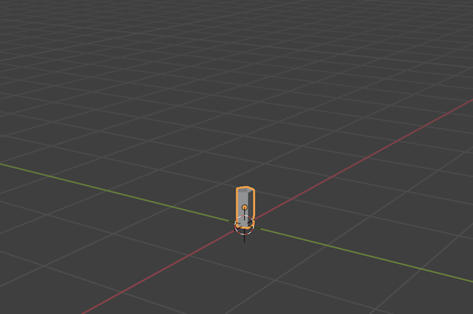
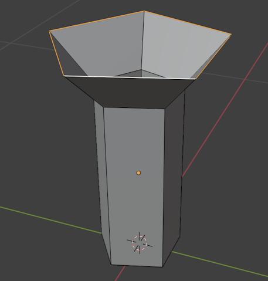
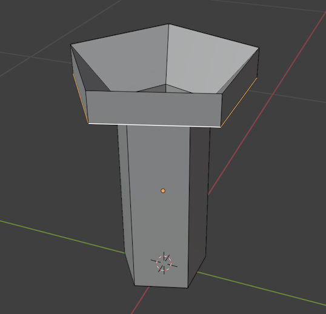
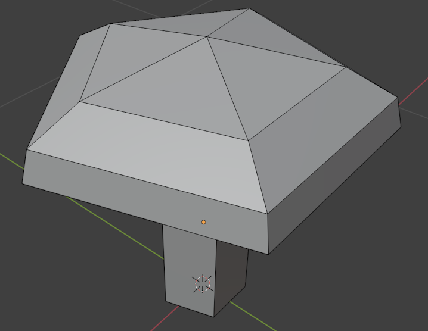
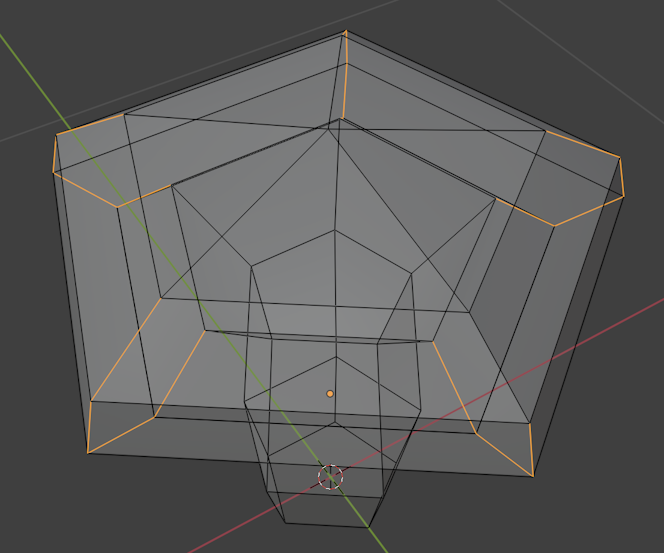

# A Low-Poly Mushroom

In this guide we'll make a low-poly mushroom like this:

* Start Blender
* Switch to the `Modeling` workspace

* Select the default Cube
* Press `X`, then `Enter` to delete the Cube

# Add a Cylinder

* Press `Shift+A` to open the Add menu
* Choose `Mesh` then `Cylinder``

* In the `Add Cylinder` options, set the following:
  * Vertices: 5
  * Radius: 0.1m
  * Depth: 0.4m
  * Cap Fill Type: None
  * Z: 0.2m

It will be rather small, but should look something like this:

> Since we're going for a low-poly look, 5 is a good start here. But even for a high-poly design this is not a bad starting value since we can add more polygons later with _modifiers_.
>
> Also, for the initial size (Radius, Depth), we're just going for something that's smaller than a typical character (1-2m tall).

# Local View

* From the `View` menu, choose `Local View` and then `Toggle Local View` to zoom in on your newly created cylinder

> This is also very handy if you create multiple objects in one Blender document and want to edit them one by one.

* You may want to zoom out a bit. _Use the `Mouse Wheel` on Windows or `Cmd+Two Finger drag` on Mac._

# Edit Mode

* Press the `Tab` key to enter **Edit Mode**, or use the `Interaction Mode` switcher:

* Press the `2` key to switch to `Edge Selection Mode`

# Extrude and Scale

* `Alt + Left-Click` on one of the top edges on your cylinder:

* Press `E` to start extruding
* Move your mouse up a bit:

* Press `Z` to restrict extrusion to the Z axis (up/down)

* Press `S` to scale, and make the loop larger:

* Press `E`, then `Z` to extrude along Z again
* This time, move *down* a bit:

* `S` to scale again:

* Repeat Extruding, Scaling a few times to get something like this:

> Avoid creating many steps. In Blender, it's generally an advantage to start out with as little geometry as possible, and the add details later.
>
> All we're going for now is the overall shape of a mushroom!

# Closing the Top

* Press the Auto-Merge Vertices button: 

* `S` to scale, then pres `0` to scale to zero and close the top of our mushroom

> Since we have auto merge vertices enabled, this will form a singular vertex at the top of our mushroom.

We now have a very coarse mushroom:

# Closing the Bottom

Notice that the bottom of our mushroom is closed. Let's fix that.

* Select the bottom edge loop (`Alt + Left-Click`)
* Press `F` to form a new Face from the loop

# Better Stem

Now that we're on the bottom, let's make the stem a little less straight.

* Press `Ctrl+R` to add a *Ring Cut*
* Move the mouse over the stem
* Click once
* Move the ring towards the bottom of the stem

* Press `S`, then move the mouse to scale the ring up a bit

# More Details

Now, let's add a bit more detail. While 5 segments are OK for the stem, the "hat" of the mushroom is probably a bit too pointy.

* Press `Alt + Z` to toggle "X-ray" mode
* While **holding `Shift`**, click and drag around the edges on each of the 5 corners of the mushroom "hat" to select them like this:

* Press `Alt + Z` to toggle "X-ray" mode off again

* Press `Ctrl + B` to start the Bevel command
* Move the mouse to get a good sized bevel:

* Check the bottom of your mushroom. If it doesn't look good, Undo (Ctrl+Z) a few times and try a different size bevel, or try beveling a different set of edges. It doesn't have to look exactly like mine.

