# Emoji Catcher


We're going to create a small game 🕹️ where the goal is to catch as many emojis as possible in 1 minute. If you've ever played whac-a-mole, this will feel familiar.

We'll use HTML, CSS and JavaScript 🦖, but we're going to take it step by step, and each step will explain exactly what to do, add, or change.

<!--
* Pay special attention to lines that have a bullet like this!

Other text explains _why_ we do what we do, and some text provides additional background, or opportunities for making the game more unique and _yours_:
-->

>💡Since Christmas is getting close, we're going to make the game in a 🎄**Christmas**🎄 theme.
>
>  But feel free to choose a theme of _**your own**_ by using different emojis and colors.

Sounds fun? Keep reading 📖


## Step 0 - It Begins


We will first need a few files where we can add _our_ code, and the HTML file first needs some basic code to even show something as simple as "Hello World".

> If you've used prototyping tools like CodePen or JsFiddle before, they hide the files, and just show _your_ code. On Replit, it shows you all the files and all the code, so you can learn how real websites are built, because it _is_ a real website. 

On Replit, when you create a new Repl with the ``HTML, CSS, JS`` template, you get the basic framework for a page that shows "Hello World".

In this tutorial, we've already done this, so the files are ready!

Let's see what it looks like:

 * Press the **Run** button (at the top of the screen)  
   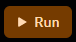

This will show your page in the pane to the right called **Webview**:

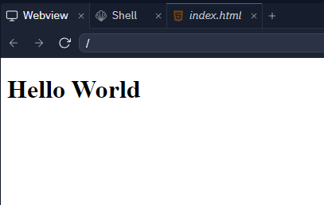

Not very exciting... _yet_!


## Step 1 - Make it Yours!


Let's change _Hello World_ to our game's name.

>💡Pick your own game name instead of "Emoji Catcher"!

 * Replace `Hello World` with `Emoji Catcher` in the `title` tag, so it looks like this:

```html
  <title>Emoji Catcher</title>
```

 * After `<body>` tag replace `Hello World` with `Emoji Catcher`, and add a `h1` tag around it to make it large:

```html
<body>
  <h1>Emoji Catcher</h1>
```

 * Press **Run** to see your changes

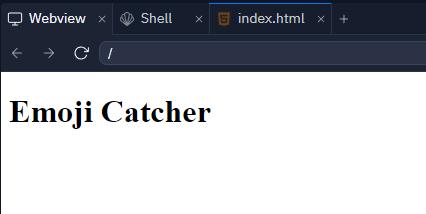

 * Press the **New Tab** button to see what your game looks like outside of Replit
   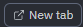

 * _Optional:_ Look at the address from the address bar in your browser.  
 If you copy and share this with others, they can see your game right away...


## Step 2 - Button Up!


Let's get started, and make a Start. A Start button to be more specific. A game needs a Start button!

 * Add this line just below ```<h1>Emoji Catcher</h1>```:

```html
  <button>Start</button>
```

The body section of your code should now look like this:
```html
<body>
  <h1>Emoji Catcher</h1>

  <button>Start</button>

  <script src="script.js"></script>
</body>
```
 * Press *Run* to see your changes:

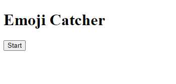

Exciting, right?

Ok, maybe not _super_ exciting. But we'll get there!

Let's first make the button _do_ something.

 * **Change** the `button` line to this:

```html
  <button onclick="alert('Hello World!')">Start</button>
```

 * Press Run, and click the Start button

Pure _Magic_ 🧙 right?

OK, maybe not _quite_ magical yet... But what we have there between the two " characters is in fact our very first JavaScript code: 
```javascript
alert('Hello World')
```


## Step 3 - Button Script


_But this is a HTML file!?_

Yes, you're right. HTML allows _embedding_ of both JavaScript and CSS on certain _attributes_, and this can sometimes be super handy. But let's try the _other_ way also.

We'll do the equivalent, but this time hooking it up in our JavaScript file.

 * Remove the `onclick` attribute from the button
 * Add an `id` attribute with the value `start`

The button line should now look like this:
```html
  <button id="start">Start</button>
```

_The `id` is not strictly necessary, but it gives us a convenient way to refer to our start button from our script._

 * Open `script.js` from the Files area
 * Enter the following code:
```javascript
let startButton = document.getElementById('start');

startButton.onclick = startClicked;

function startClicked() {
  alert('Start clicked!');
}
```
 * Try running your project again.

The behavior (and amount of magic!) should be exactly the same as before - but this time with _more_ code.

>❓In general, you should never have code that doesn't have a purpose, but as with most things, it's a balance, and in this case the purpose of the longer code is that it allows us to _scale_ our game. While the shortcut we used before can be super handy, it's not scalable to building a full game!


## Step 4 - Buttons Buttons Buttons!


In this step we're going to make the basic game board, with some Emojis to clicking.

 * Add the following code below your start button line:

```html
  <button>❄️</button>
```
_You can type emojis by pressing **Win + .** (on Windows) or the **Globe key** (on Mac), then type in a word to search.  
Or use a site such as https://unicode.party/_

The body section of your code should now look like this:
```html
<body>
  <h1>Emoji Catcher</h1>

  <button id="start">Start</button>

  <button>❄️</button>

  <script src="script.js"></script>
</body>
```
 * Press *Run* to see your changes:

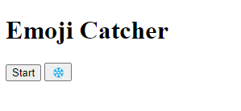

It's a bit annoying that the Start button is on the same line as our emoji button.

 * Add a `div` around the button, to give it some space. We'll also give it an `id` so we can get at this from our script

```html
<div id="game">
  <button>❄️</button>
</div>
```

 * Now, add some more buttons, so that you have 9 in total. For each 3 buttons, add a `<br>` (break) tag to make a new line:

```html
<div id="game">
  <button>❄️</button>
  <button>🎄</button>
  <button>❄️</button>
  <br>
  <button>❄️</button>
  <button>❄️</button>
  <button>❄️</button>
  <br>
  <button>❄️</button>
  <button>❄️</button>
  <button>❄️</button>
</div>
```

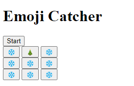

It's starting to look a little bit like a game.

We'll get back to adjusting the style 🎨, but we'll do a little bit now - make the buttons larger, so it's easier to test our game during development.

 * Open `style.css` from the **Files** area
 * Add the following CSS code to at the end:

```css
button {
  font-size: 20pt;
  margin: 4pt;
}
```

`button` adds a CSS "rule" that will apply every `<button>` tag. Pay attention to the `{` and `}` as they serve as the start and end of the rule!  
`font-size` will make the emojis larger (which in turn will make the buttons larger).  
`margin` makes a bit of room between the buttons.

It should look like this now:

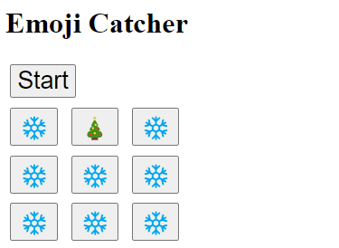

_If you already know CSS, feel free to tweak the look and feel some more. You can get far with `background-color`, `color` on **html** and `border` on **button**._


## Step 5 - Clicky Buttons


 * Open `script.js` again and insert this code after the existing code:  

```javascript
// Get all of our game buttons
// The #game part makes sure we don't get any buttons outside our div with id="game"
let gameButtons = document.querySelectorAll('#game button');

// Iterate over each button, so we can hook them up
for (let button of gameButtons) {
  // "Connect" the 'click' event to our 'gameButtonClick' function
    button.addEventListener("click", gameButtonClick);
}

// Player clicked a game button
function gameButtonClick(event) {
  // event.target is the button, and textContent is the emoji that we put there
  let emoji = event.target.textContent;
  alert(emoji);
}
```

> _Note that lines starting with `//` are **comments** and explain what the following line(s) does and/or why we need it.  
It's good practice to write meaningful comments. Both for others who might read your code later, but also for yourself in a few months or years, when you might come back to improve your glorious game - or fix a bug 🪲_

 * Run the game, and click a few emojis **and** the start button to test it works as expected


## Step 6 - Right From Wrong


Ok, those pop-up alerts are getting a bit tedious. Let's try and do something else when we press a button. And let's try to check if we actually click what's _right_.

In our example, 🎄 are right - anything else is not!

Let's make a counter for the candies (or whatever you've chosen in your version of the game).

 * Add the following line to `script.js` - before the `gameButtonClick` function:

```javascript
// Number of 'right' emojis clicked
let counter = 0;
```

 * And update `gameButtonClick` so it looks like this:

```javascript
// Player clicked a game button
function gameButtonClick(event) {
  // event.target is the button, and textContent is the emoji that we put there
  let emoji = event.target.textContent;

  // If we clicked the 'right' emoji, increment counter
  if (emoji === '🎄') {
    counter += 1;
  }
  
  alert(counter);
}
```

But the alert boxes are still rather tedious. Let's try something else...


## Step 7 - The CONSOLE

 
 * In the `gameButtonClick` function, replace `alert` with `console.log`, so the line looks like this:

```javascript
// Player clicked a game button
function gameButtonClick(event) {
  // event.target is the button, and textContent is the emoji that we put there
  let emoji = event.target.textContent;

  // If we clicked the 'right' emoji, increment counter
  if (emoji === '🎄') {
    counter += 1;
  }

  console.log(counter);
}
```

Voila! The alert boxes are gone! But... where did our message (the count) go?

 * In Replit, press the **Devtools** button in the Webview  
  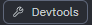

This will show an area with _Developer Tools_, including the **_Console_**. Anytime your code calls a `console.log` a new line will be added to the Console containing a textual version of whatever you pass as arguments (in this case `counter`).

Here's what it can look like after clicking a few buttons:

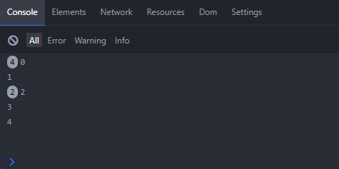

The circled numbers in front of some lines appear if you call `console.log` with the _same_ text **multiple** times.

> ❗Remember `alert` and `console.log`. They can be your best friends when you are trying out new code or _debugging_ - the black art of finding and fixing problems (bugs) in code.

 * If you need the room on your screen, press the _Devtools_ button again to hide the Console


## Step 8 - On Screen


Now, since the counter is actually part of the game, we should probably show it to the player as part of the game instead.

For this we need to go back to HTML again.

 * In `index.html` add this **before** `<div id="game">`:

```html
<div id="hud">
  Points: <span id="counter">0</span>
</div>
```

The font is a little off, and the whole thing feels a bit... misaligned. Lets fix it in CSS.

 * In `style.css` update the `html` section to this:

```css
html {
  height: 100%;
  width: 100%;
  font-size: 16pt;
  font-family: Arial, Helvetica, sans-serif;
  text-align: center
}
```

Now we just need to update the text for the points counter instead of writing it to the console.

 * Back in ´script.js´ add a new function at the end:

```javascript
// Set the text of an element
function setText(id, text) {
  let element = document.getElementById(id);
  element.textContent = text;
}
```

 * In `function gameButtonClick` replace
```javascript
  console.log(counter);
```
with
```javascript
  setText('counter', counter);
```

It should look something like this now:

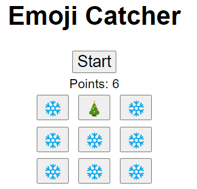

>❓We could of course also just have made a function called `updateCounter` that did exactly this, but since we (hint hint) also want to display the remaining time ⏱️ later, the setText function can be used for both purposes, and it follows the same idea as using `alert` and `console.log`.


## Step 9 - The Hard Part


Nice work so far 👏

The game is a little easy though. And _long_. We kind of need an ending.

But first, let's make the game *harder* by moving the 🎄 around - literally speaking.

We've already got a way to _iterate_ (or loop) over our game buttons. Remember this line from above:

```javascript
for (let button of gameButtons) {
```

We can re-use this to change the emoji on each of the buttons. And throw a bit of randomness in the mix also.

 * Add the following function to `script.js`. It's a bit rough, but it's a start.

```javascript
function mixItUp() {
  // An array of emojis to pick from
  let emojis = ['🎄', '❄️'];
  for (let button of gameButtons) {
    // Randomly select a emoji
    let randomIndex = Math.floor(Math.random() * emojis.length);
    let randomEmoji = emojis[randomIndex];
    button.textContent = randomEmoji;
  }
}
```

We also need to actually _call_ the function, or it won't do us much good.

 * At the end of the `gameButtonClick` function, add this line:

```javascript
  mixItUp();
```

 * Run the game to try it out!

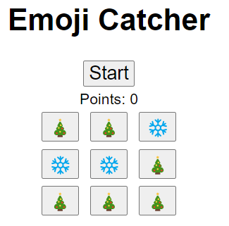

Now, it would be nice if the initial board is also random. Fortunately that's easy.

 * Add the same line again, this time at the very end of `script.js` - outside of all the functions.

>❓Code at the topmost level in the script will be run when the script is loaded.
> This _can_ be a problem, but in our case we've made sure that the `<script>` tag that loads the script is at the _end_ of the HTML file, which means all of the HTML structure is already in place at that time.


## Step 10 - Even Harder


Ok, ok, with just two emojis to pick from, the game is still rather easy. Let's fix that...

 * Make the array of emojis in `mixItUp` longer:

```javascript
  let emojis = ['🎄', '🦌', '🌲', '⭐', '❄️', '🔔', '🎁', '⛄', '🎉'];
```

That ought to fix it, right?... Right?

 * Press Run and test the game

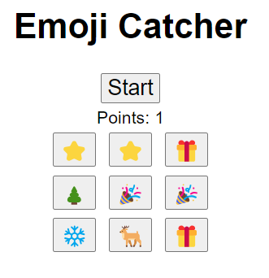

Ok, so sometime we still get multiple 'right' emojis. That's maybe not _so_ bad... But (and you've probably noticed this by now) sometimes we will get **no** right emojis at all 😒 And that kind of breaks the game 🪲🪳🕷️

Back to the drawing board... This random business is kind of tricky.

Rather than trying to 'fix' the list or the random function, let's try a different approach.

What if we leave the 'right' emoji out of the list, and then just choose a (random) button to become the bearer of the right emoji?

Let's try that...

 * Here's an updated version of `mixItUp`

```javascript
function mixItUp() {
  // An array of 'wrong' emojis to pick fro
  let wrongEmojis = ['🦌', '🌲', '⭐', '❄️', '🔔', '🎁', '⛄', '🎉'];
  for (let button of gameButtons) {
    // Randomly select a wrong emoji
    let randomIndex = Math.floor(Math.random() * wrongEmojis.length);
    let randomWrong = wrongEmojis[randomIndex];
    button.textContent = randomWrong;
  }

  // Add the 'right' one to a random button 
  let rightEmoji = '🎄';
  let randomIndex = Math.floor(Math.random() * gameButtons.length);
  let randomButton = gameButtons[randomIndex];
  randomButton.textContent = rightEmoji;
}
```

 * Try it - it _should_ work now

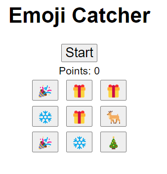


## Step 11 - Something Smells in Here


Still, there's a bit of a "smell" to this code. As an aspiring software rockstar 🧑‍🎤 we can't have that!

We've kind of repeated ourselves with this Math random code. Also known as REPETITION 😨 or _the bane of good code_ †. It would be nice to have a little function that just picked random element from an array, and gave us that.

Bad news first: JavaScript doesn't come with one.  
Good news: We can easily make one! In fact, we already have the "brains" of this function - twice even!

 * Add the following function to `script.js`

```javascript
function pickRandom(array) {
  let randomIndex = Math.floor(Math.random() * array.length);
  let randomElement = array[randomIndex];
  return randomElement;
}
```

* And now we can simplify `mixItUp` to this:

```javascript
function mixItUp() {
  // An array of 'wrong' emojis to pick fro
  let wrongEmojis = ['🦌', '🌲', '⭐', '❄️', '🔔', '🎁', '⛄', '🎉'];
  for (let button of gameButtons) {
    button.textContent = pickRandom(wrongEmojis);
  }

  // Add the 'right' one to a random button 
  let rightEmoji = '🎄';
  let randomButton = pickRandom(gameButtons);
  randomButton.textContent = rightEmoji;
}
```

Better, right? Notice how we don't even need the comment that we're picking a random wrong emoji because that's literally what the code says in plain English - only mashed together a little bit, because this is code afterall.

Code `pickRandom(wrongEmojis)`.  
English `pick random from wrong emojis`.  
Close enough?

> † While it is a very good rule of thumb to avoid repetition, there _are_ exceptions. A more important rule is that your first and foremost code should be easy to _read_ ‡. By others, but also by future you. We're going to try to do _both_ here.

> ‡ Really, another exception? (Yes) Readability may *sometimes* have to make way in the name of PERFORMANCE 🏎️ - the holy grail 🏆 sought for, by software developers around the globe (and beyond, I suspect). But that is hardly a priority for our tiny little game at this point.

Apologies for the slight detour, but this readability stuff is important. And it only becomes more important as a project grows larger.

Back on track...


## Step 12 - Ending This


Ok, while we're not _quite_ at the end of this Tutorial, we do need a way to end the game 🏳️

We started out by stating that the game should last for 1 minute. Lets maybe try that.

Also, our good old Start Button should finally come to good use! It's been sitting there idle all this time (sorry Start Button, and thanks for your patience!).
<!--
In JavaScript, we've got multiple options for dealing with Time.

We can keep track of the time that has passed since a certain point in time. This is the more accurate option as it uses the actual clock in the computer, but requires more code to set up, and also to handle the time calculations.

We have also got a handy function called 'setTimeout' which allows us to run code at some point in the future. It's pretty cool, and while it sadly can't make us time travel, it's super easy to use and plenty powerful for what we're going to do here.
-->
But first, let's make a place where we can show the remaining time, and a way to keep track of the remaining time.

 * In `index.html`, add this just before the Points line
```html
  Time: <span id="time">0</span> s<br>
```

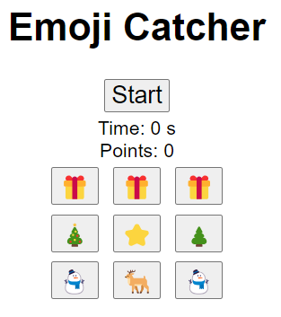

* In `script.js`, add this after the `startClicked` function

```javascript
let secondsLeft = 0;

function gameTick() {
  setText('time', secondsLeft);

  secondsLeft -= 1;
  
  if (secondsLeft <= 0) {
    alert("Game Over!");
  }
  else {
    setTimeout(gameTick, 1000);
  }
}
```

 * And update the `startClicked` function to this:

```javascript
function startClicked() {
  secondsLeft = 60;
  gameTick();
}
```

>❗While testing the game, it can be nice to lower this to something like `secondsLeft = 5`.


## Step 13 - Finishing Touches


13... Isn't that unlucky? Not really. Besides this is really the 14th step because we start with 0. Just like JavaScript does 0 is the first element in an array, and 13 is the 14th!

Anyway, we digress. And we've still got some work to do.

First of all, having the Start button still around after you've Started the game is not very nice, and also it can cause problems if you press it multiple times (because we'll end up with multiple timers running in parallel). Try it, and if you get stuck in Game Over alerts, reloading the page will set you free!

 * Add this to `startClicked` to **hide** the start button when it's clicked:

```javascript
  startButton.style.display = "none";
```

 * Add this to `gameTick`, just after the `alert` call:
```javascript
  // Show the start button again, by removing (with null) the override set to hide it
  startButton.style.display = null;
```
> We're adding an elaborate comment here, because it's not really obvious that `null` will have the effect of _showing_ the button again.


## Step 14 - Excercises


_Phew. We didn't end on 13 afterall!_

So we've got a game, and it's pretty awesome, right?

Can it get any better?

Maybe?

Here's a few ideas:

* Using the code from Step 13, make two small helper functions and use them like this instead of the code we added in Step 13:  
  `hide('start')` and `show('start')`.  
  Hint: You'll need the first line from `setText` to look up an element from it's id
  
* Before start, hide Time and Points.  
  Hint: `hide('hud')`

* Replace the Game Over `alert` with a `<div id="gameover">` that get's shown instead.  
  Hint: You'll need the `show` and `hide` functions again

* Change the button styles to match your chosen theme.  
  Hint: CSS `border` and `color`. Google can help
  
* Change the background color to match your chosen theme.  
  Hint: CSS `background-color`
  
* Deduct a point if you click a wrong emoji.  
  Hint: `else` and `counter -= 1`
  
* Add animation when clicking the buttons.  
  Hint: `button:active { transition: 0.1s; transform: scale(1.1); }`

But I'm sure your own ideas are way better. You'll probably need Google, but there's also an AI button in Replit that you might want to try out. 

I can't wait to see what you've made!

/Marken
