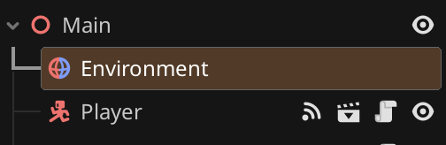
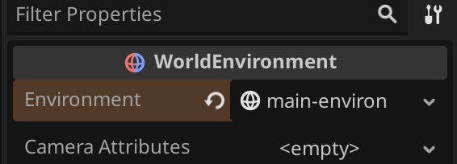

# Changing Environment

Now that we have multiple levels, and a way to move between levels, it might be interesting to have different lighting and look on some levels.

You may have noticed the  `Environment` node at the top of the scene tree. This holds the settings controlling things like the background, some lighting and effects like fog and glow.

* Select the Environment node

 * In the Inspector, click the `Environment` value

* Change `Ambient Light`, `Source` to `Disabled`.
* Change `Background`, `Mode` to `Custom Color`.
* Change `Background`, `Color` to _black_.
* Try your changes.

Now, before we go any further we'll want to consider whether you want these changes 

