Before you can get other people to play your glorious game, you will need to _export_ it.

Godot supports exporting to many different platforms: Windows, Mac, Linux, Web, Android, iOS and more.

* Choose **Export...** from the **Project** menu:

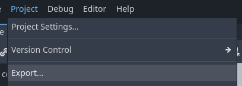

* Choose `Add...` then `Web`:

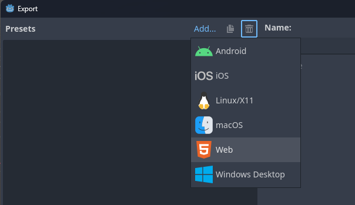

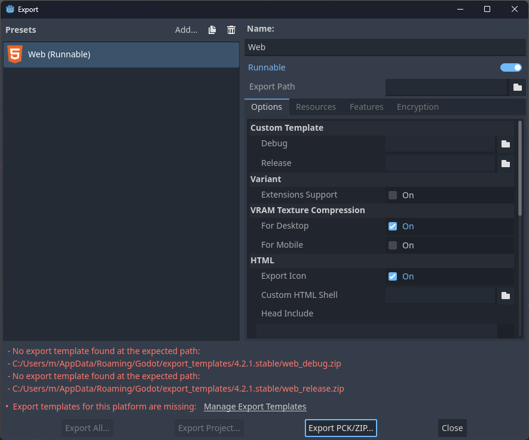

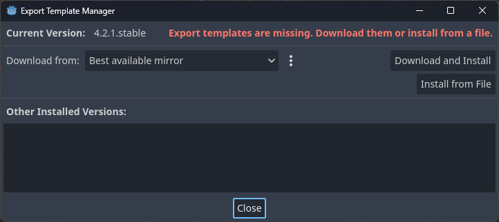

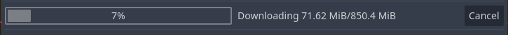

* Press **Close**

* Press **Export Project**:

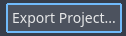

* Press **Create Folder**:

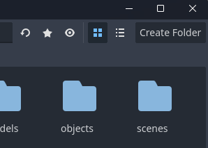

* Name the folder "build"
* In the `Name` field, use something short and filename-friendly like "web":

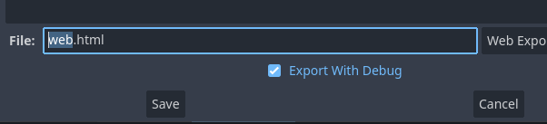

* _Optional:_ Un-check `Export With Debug` - if you are exporting for distribution to others

* Press **Save**

This should only take a moment...

* Press **Close**

You can now find the files in the export folder:

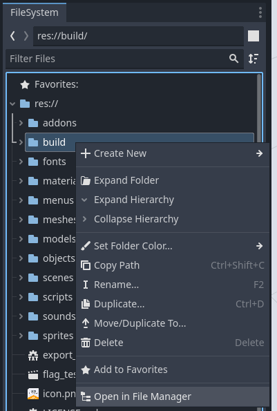

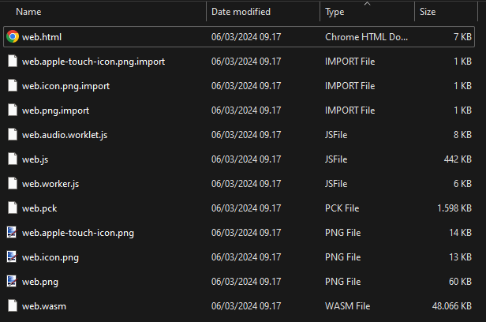

The `.pck` file contains your game. If you make changes in the game, it's usually enough to re-upload this file.

You probably want to rename the .html file to `index.html` first, though.
If you upload these files to a suitable host (like itch.io) it _should_ work. However, Godot 4 uses some fairly new technologies in the web export... TODO

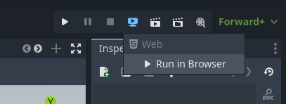

