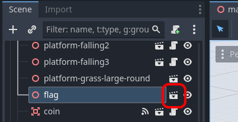
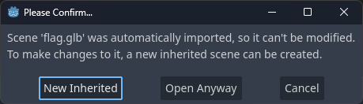
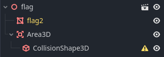
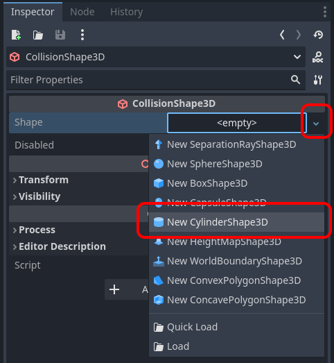
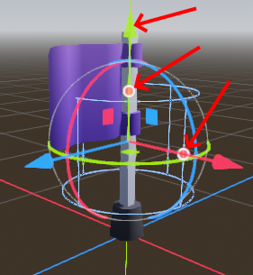
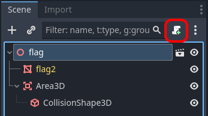

## Flags transport to other scene (aka "Portals")


First we need a scene and script for the flag node.

* Click the `Open In Editor` icon to the right of the `flag` node



* Choose `New Inherited`



_This is necessary because we don't actually have a scene for flag yet. It's used directly from the Blender asset._

* Add an `Area3D` and a `CollisionShape3D` nodes




* Select `CollisionShape3D`
* Create a new `CylinderShape3D`



* Use the handles to adjust the size so it looks roughly like this:




* Add a script on the flag node



* Update the `Path` to `res://scripts/flag.gd`

* Update the script code to this:

```gdscript
extends Node3D

signal captured
@export_file("*.tscn") var load_scene: String

func _on_area_3d_body_entered(body):
	# Wait a bit to allow the player to "land" on the flag
	await get_tree().create_timer(.15).timeout

	# Fly up for half a second
	body.gravity = -100
	captured.emit()
	await get_tree().create_timer(.5).timeout

	if load_scene and get_tree():
		get_tree().change_scene_to_file(load_scene)
```

* Save the flag scene by pressing Ctrl+S - you can place it in the `objects` directory

* Go back to your "level" scene

* Select the flag

* In the inspector, you now have the ability to pick 

* Effect: Fly player up/down
* Effect: Camera looks up/down
* Sound, rotation etc.
