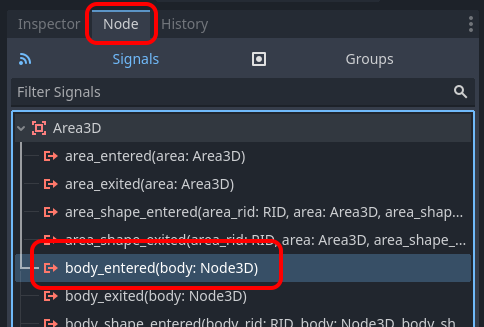
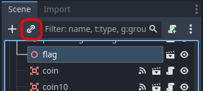
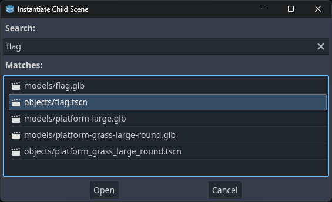
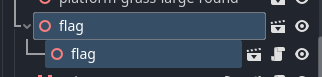
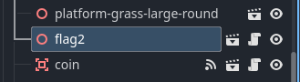
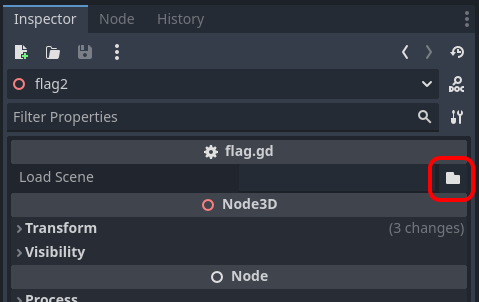

# {{ page.title }}

> Created with Godot 4.2

Let's see if we can make the flags load another scene, af if the flag is a "portal" that transports the player to the other scene.

First we need a scene and script for the flag node.

* Click the `Open In Editor` icon to the right of the `flag` node


* Choose `New Inherited`


_This is necessary because we don't actually have a scene for flag yet. It's used directly from the Blender asset._

* Add an `Area3D` child node
* Add a `CollisionShape3D` node under the `Area3D`


It should look like this:


* Select `CollisionShape3D`
* Create a new `CylinderShape3D`


* Use the handles to adjust the size so it looks roughly like this:


* Add a script on the flag node


* Update the `Path` to `res://scripts/flag.gd`

* Select the `Area3D` node

* Connect the Area3D `body_entered` signal with the script
 1. Click the `Node` tab
 2. Double-click `body_entered(body: Node3D)` in the list of signals



  3. Press the `Connect` button

* Update the script code to this:

```gdscript
extends Node3D

signal captured
@export_file("*.tscn") var load_scene: String

func _on_area_3d_body_entered(body):
	# Wait a bit to allow the player to "land" on the flag
	await get_tree().create_timer(0.15).timeout

	# Fly up for half a second
	body.gravity = -100
	captured.emit()
	await get_tree().create_timer(0.5).timeout

	if load_scene and get_tree():
		get_tree().change_scene_to_file(load_scene)
```

_Check that you still have the  icon in front of the `_on_area_3d_body_entered` method. Otherwise, go back and check the signals!_

* Save the flag scene by pressing Ctrl+S - you can place it in the `objects` directory

* Go back to your "level" scene

We need to replace the Flag node with our _new_ flag Scene.

* Select the flag node
* Press the Instantiate Child Scene button (Ctrl+Shift+A)



 * Find the scene you just created (`flag.tscn`) - be careful to *not* pick the .glb file as that's the one we're trying to replace, and



* Press **Open**

You will now have two flags under each other. That's OK, because this means that our new flag gets the position of the original flag!



* Drag the second flag (with the script icon) above the original flag 

It will get renamed to `flag2` to avoid duplicate names.

* Delete the original flag



* Select `flag2`

* In the inspector, you now have a new property `Load Scene`

* Press the Folder icon to pick another level (or just pick the same scene if you haven't created another level yet)



* Test your game!

_If you get issues immediately when you start the game, check that you don't have platforms or other objects interfering with your flag's collision cylinder._

Now, it's probably a good time to [make more levels](duplicate_levels.md) so this can become a _proper_ game.
