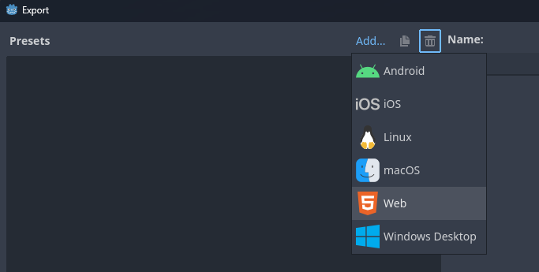
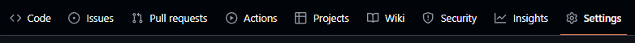
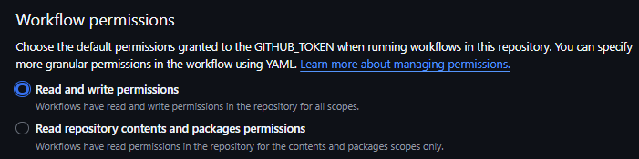
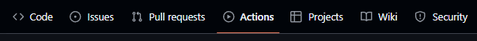
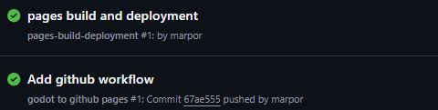
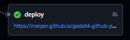
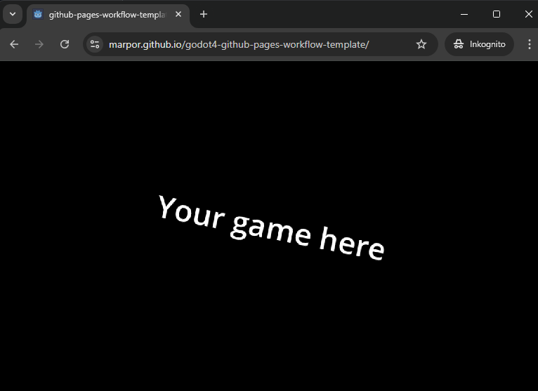

In this guide, you'll configure a "Web" export for your Godot project, push the export to GitHub, and set up GitHub Actions to deploy your game to GitHub Pages.

> If your project is not yet hosted on GitHub, see the the [Setup GitHub Desktop](github_desktop_setup.md) guide.

## 1. Set up Web Export in Godot

1. Open your Godot project.
2. Go to **Project** > **Export**.
3. Click **Add...** and select **Web** as the export template.



You can leave everything as default.

4. Press `Close`

## 2. Configure GitHub Settings

* Go to your repository on GitHub.
* Click the **Settings** tab



* Click **Actions** > **General**


* Find `Workflow permissions`

* Enable `Read and write permissions`



* Press `Save`

> This is needed for the action to be able to write a gh-pages branch back into your repo. If you don't do this you'll get an error like:
```sh
remote: Permission to name/your-repo.git denied to github-actions[bot].
fatal: unable to access 'https://github.com/name/your-repo.git': The requested URL returned error: 403
```

## 3. Set Up GitHub Actions for Deployment

1. In the root of your repository, create a `.github/workflows` directory if it doesn’t exist.
2. Create a new `godot-to-github-pages.yml` file in `.github/workflows/`, and paste the following instructions:

```yaml
name: "godot to github pages"
on: push

env:
  GODOT_VERSION: 4.3
  EXPORT_NAME: ${{ github.event.repository.name }}
  PROJECT_PATH: .

jobs:
  export-web:
    name: Web Export
    runs-on: ubuntu-20.04
    timeout-minutes: 10
    container:
      image: barichello/godot-ci:4.3
    steps:
      - name: Checkout
        uses: actions/checkout@v4
        with:
          lfs: true
      - name: Setup
        run: |
          mkdir -v -p ~/.local/share/godot/export_templates/
          mv /root/.local/share/godot/export_templates/${GODOT_VERSION}.stable ~/.local/share/godot/export_templates/${GODOT_VERSION}.stable
      - name: Web Build
        run: |
          mkdir -v -p build/web
          cd $PROJECT_PATH
          godot --headless --verbose --export-release "Web" build/web/index.html
      - name: Upload Artifact
        uses: actions/upload-artifact@v4
        with:
          name: web
          path: build/web
      - name: Install rsync 📚
        run: |
          apt-get update && apt-get install -y rsync
      - name: Deploy to GitHub Pages 🚀
        uses: JamesIves/github-pages-deploy-action@releases/v4
        with:
          branch: gh-pages # The branch the action should deploy to.
          folder: build/web # The folder the action should deploy.
```

3. GitHub Actions will automatically build and deploy your project to GitHub Pages upon each push to the `main` branch.

4. Click the `Actions` tab



After a couple of minutes you should see two runs like this:



5. Click `pages build and deployment`

6. On the Deploy node you should see a link to your new page with your Godot game:



This is a public link that you can share with the world, and the best part is that the game on the page will automatically update whenever you push updates to GitHub!



