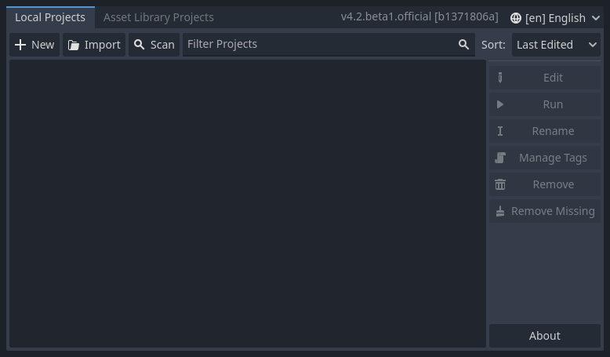

# Download and "Install" Godot

* Go to [www.godotengine.org](https://www.godotengine.org)
* Click the "Download Latest" button

* Once downloaded, Open the file
* Drag the file _without_ "console" in the name to your Desktop (or another place where you can easily find it again)

It may look slightly different depending on your version of Windows, or on Mac, but it's still pretty similar.

* *Double-Click* on the file you just unpacked to start Godot

# The Project Manager

The first thing you see in Godot is the Project Manager:

If you've used Godot before, it will list your previous projects here.

In the Future, you can create new projects and open existing projects from here.

