IKKE FÆRDIG!!!

I denne vejledning vil i komme til at lave en lille 3D scene, med kugler der falder ned og overholder fysikkens regler.

I vejledningen er de enkelte ting man skal gøre, opstillet som disse:

* Gør dit
* Gør dat

Øvrig tekst forklarer nærmere hvad det er vi gør, og skærm billeder er tænkt som en hjælp til at følge med.

Lad os nu komme igang!

# Start Godot

* Hent seneste version af Godot 4. *Hvis altså ikke du allerede har det.*

  **ENTEN:**

    * Hvis du har Steam på din computer, kan du installere her: [Steam - Godot Engine](https://store.steampowered.com/app/404790/Godot_Engine/)

  **ELLER:**

    * Gå til [godotengine.org/download/](https://godotengine.org/download/)
    * Brug den første download knap på siden (vi behøver ikke .NET)
    * Åben .zip filen med Godot. Den indeholder to filer.
    * Træk den største fil ud på dit skrivebord, eller et andet sted du kan finde igen.
    * Dobbelt-klik på filen for at starte Godot.
      _Godot skal ikke installeres. Dobbelt-klik på samme fil igen næste gang du vil starte Godot_

Hvis det er første gang du starter Godot får du muligvis følgende besked:

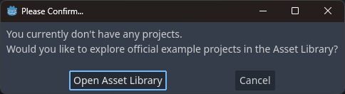

* Tryk **Cancel**. Vi vil lave vores eget projekt i næste skridt 😄

I denne Tutorial bruger jeg version 4.1.1. Der kan være forskelle hvis du bruger en anden version.

# Lav et nyt Godot projekt

* Tryk New Project

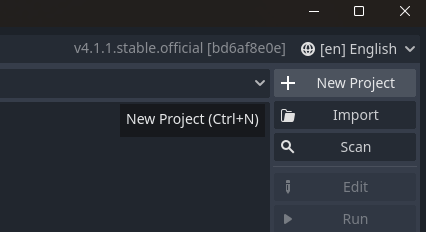

* I **Create New Project** dialogen
  * Indtast et passende navn for dit projekt. For eksempel LysOgKugler
  * Hvis ikke Project Path er et godt sted til dit projekt, så vælg et andet ved at trykke på **Browse** knappen
  * Tryk **Create Folder**
  * Under **Renderer** vælg **Forward+**, med mindre du har et ældre grafikkort, så kan du prøve Mobile i stedet.

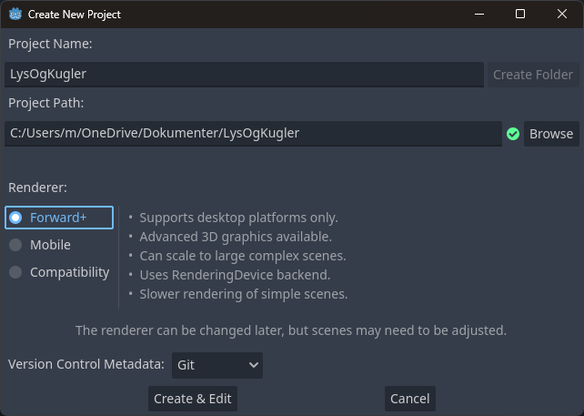

Et øjeblik senere skulle du gerne være i Godot's hoved vindue, og du er klar til at gå igang med Trin 1.

# Trin 1 - Byg en scene

* Tryk **3D Scene** under Scene, Create Root Node:

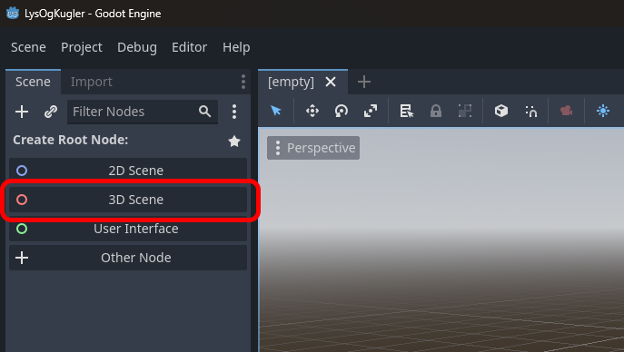

* Klik på din nye **Node3D** node for at omdøbe den
* Kald den fx "Main"
* Tryk Ctrl+S for at gemme den
* Tryk Save

Det skulle gerne se sådan her ud:

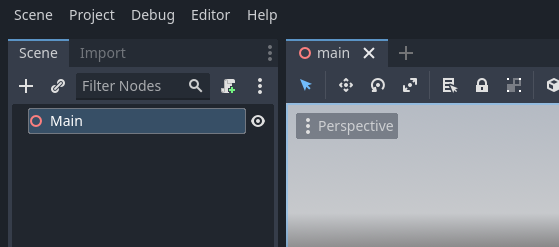

* Tryk på +'et over "Main"

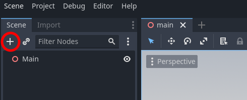

* Find CSGBox3D ved at søge efter "csgbox" - eller find den i listen under Node3D

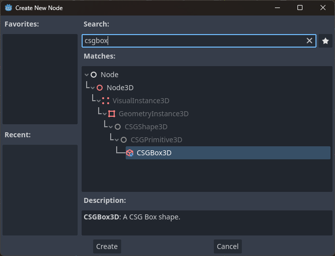

*CSG står for "Constructive Solid Geometry". Det er en form for 3D modellering i stil med hvad du finder i fx Blender eller Fusion 360, men meget simplere og godt til at lave lidt hurtig geometri med direkte i Godot. Hvis du er nysgerrig, kan du læse mere her: [Prototyping levels with CSG](https://docs.godotengine.org/en/stable/tutorials/3d/csg_tools.html)*

* Tryk **Create**

Tillykke, du har nu lavet din første 3D kasse i Godot! 🎉

Du skule gerne kunne se kassen både under **Scene** til venstre, visuelt i midten af skærmen, og dens forskellige egenskaber og indstillinger under **Inspector** i højre side.

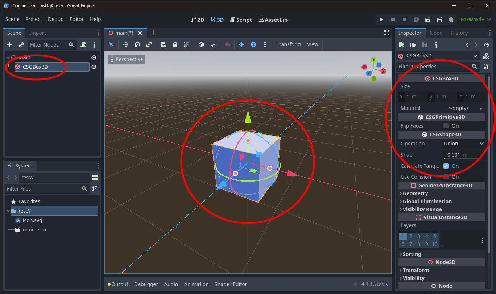

Vi vil gerne have kassen til at være "gulv" i vores 3D scene. 

* Træk i de tre markører  for at ændre størrelsen på din kasse

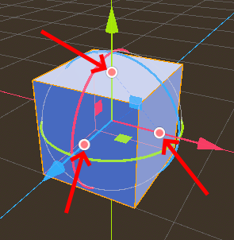

* Gør kassen fladere, bredere og dybere, som her:

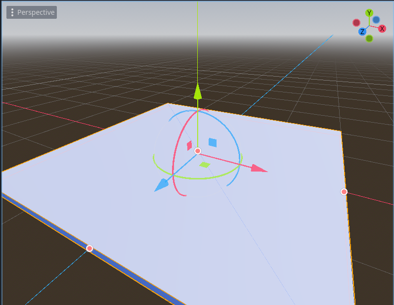

## Kamera

Før vi kan se noget i vores spil skal vi have tilføjet et kamera.

* Sørg for at **Main** er valgt under Scene (dvs. den er markeret med en anden farve).
  * Hvis den ikke er, så klik en enkelt gang på den.

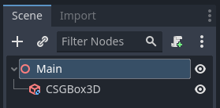

* Tryk igen på +'et over "Main" for at tilføje en ny **Node**.

Det her kommer vi til at gøre en del, da alt i Godot er bygget op på denne måde. Der er endda en genvejstast Ctrl+A (Cmd+A på Mac).

* Find **Camera3D**, enten ved at kigge under Node3D eller ved at søge efter "camera". Bemærk at alle de røde elementer er til 3D, mens de blå er til 2D.
* Tryk **Create**

Dit kamera starter med at være placeret midt i gulvet. Det er ikke super praktisk, så lad os flytte det lidt.

* Træk i den Blå og den Grønne pil for at flytte kameraet bagud og opad.

Før:

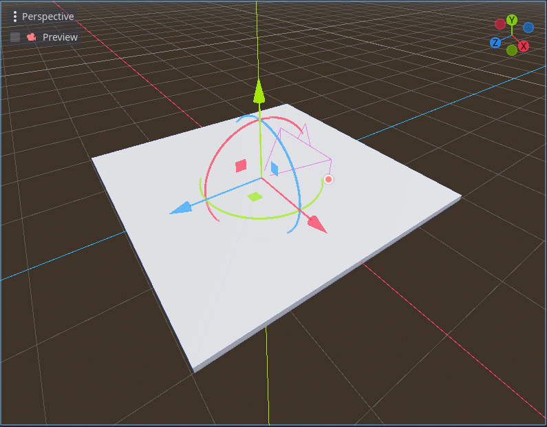

Efter:

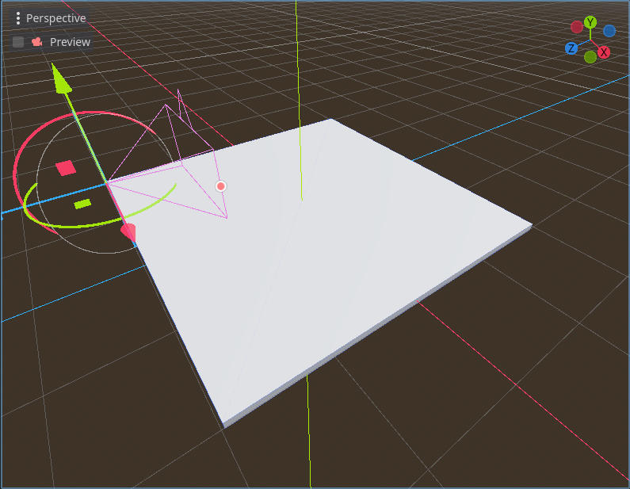

Du kan med fordel prøve at sætte hak i ud for **Preview**, for at se hvad kameraet ser. Det burde se ud i stil med dette:

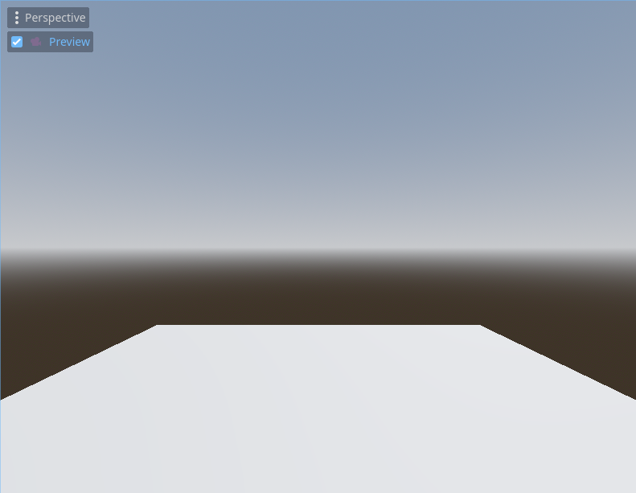

