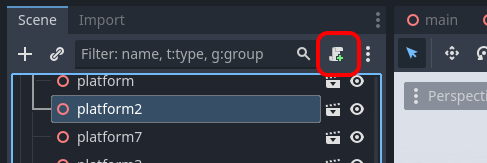
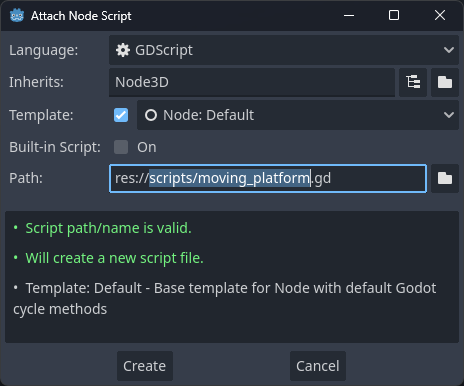
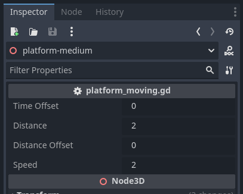
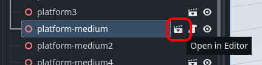
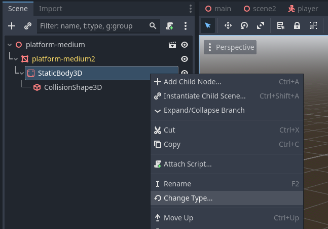
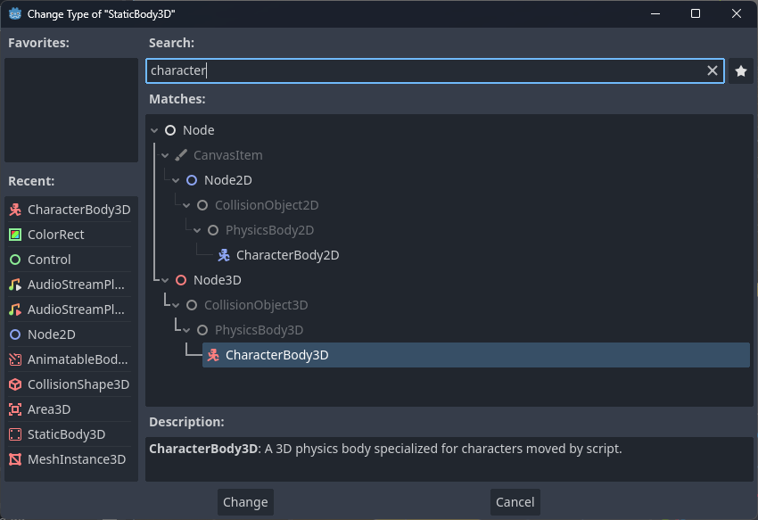
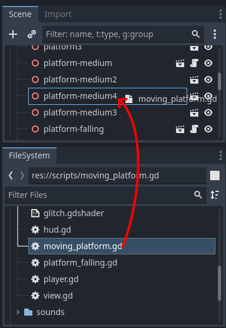

# {{ page.title }}

> Created with Godot 4.2

In this mini-guide we will make platforms move smoothly from side to side in a [_sinusoidal_](https://en.wikipedia.org/wiki/Sine_wave) motion.

<video controls src="moving_platforms/example.mp4" title="Title"></video>

 *We're building on the work in [Godot Quick Start - 3D Platformer](./quick_start_3d_platformer), but the instructions and script should work for similar types of 3D scenes in **Godot 4**.*

* Select the platform you want to make moving
* Click the Attach Script button



* Update the name of the script (in Path)
  * For example `scripts/moving_platform.gd`
* Press Create



* Replace the new script with this code:

```gdscript
extends Node3D

var time := 0.0
@export var time_offset := 0.0
@export var distance := 2.0
@export var distance_offset := 0.0
@export var speed := 2.0

@onready var startpos := position

func _process(delta):
	# Sine movement
	position = startpos
	position.x += cos((time + time_offset) * speed/distance) * distance + distance_offset

	time += delta
```

* Try your changes. The platform with the script should have started moving.
* You can adjust the distance, speed etc. with the properties we added with the `@export` vars in the script.



Now, there is just one problem. **The player doesn't move with the platform!!** 😢

This is fortunately quite easy to fix: Just change the body type from `StaticBody3D` to `CharacterBody3D`:

* Click the *Open in Editor* icon on the platform



* Right click the `StaticBody3D` node



* Find the `CharacterBody3D` type



* Press *Change*

* Switch back to the scene that contains your moving platform and try again.

To make additional platforms moving, you just need to attach the same script to the platform nodes:

* Drag `moving_platform.gd` from FileSystem onto additional platform nodes.



💡 _In the example video above, I've set a different value for the `Time Offset` property on each platform so they move out of sync._

Now, you can extend the script to support other types of movements, or make separate scripts for each type of movement. I leave you with a few ideas:

* Up-down motion - just change y instead of x of position
* Rotation instead of moving
* Harder: Move between two points. Either specify the two points using coordinates, or maybe use an `@export var Path`

Have fun!
