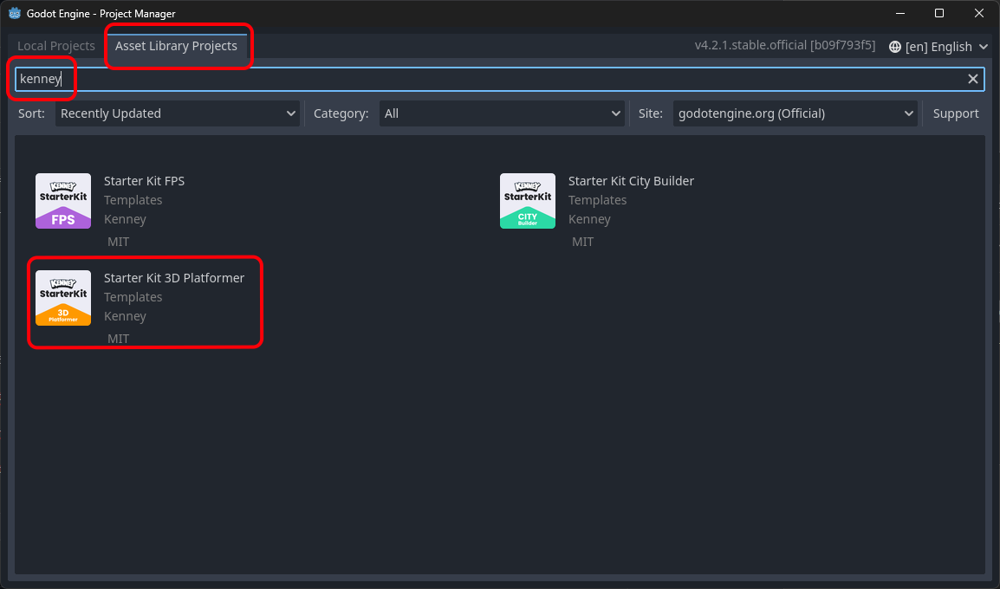

# Godot Quick Start - 3D Platformer

In this short guide you'll get started with Godot 4.2 _quickly_, using the 3D Platformer Starter Kit by Kenney.

# Godot?

If this is your first Godot Tutorial, you may want to:

* Read [Introduction to Godot](https://docs.godotengine.org/en/stable/getting_started/introduction/introduction_to_godot.html)

# Download and "Install" Godot

* Go to www.godotengine.org
* Click the "Download Latest" button

* Once downloaded, Open the file
* Drag the file _without_ "console" in the name to your Desktop (or another place where you can easily find it again)

It may look slightly different depending on your version of Windows, or on Mac, but it's still pretty similar.

* *Double-Click* on the file you just unpacked to start Godot

# The Project Manager

The first thing you see in Godot is the Project Manager:

If you've used Godot before, it will list your previous projects here.

In the Future, you can create new projects and open existing projects from here.

# Start with a Template

In this guide, however, we will use a specific, _and awesome_ template available in the Asset Library.

* Click on the the *Asset Library Projects* tab
* In the Search Field, type "Kenney"

* Click "Starter Kit 3D Platformer"
* Press Download

* _Optional:_ Change "Project Path" to where you would like your Godot projects to be stored
* _Optional:_ Change "Project Name" to something else
* Press Create Folder
* Press Install & Edit

You may get a warning like this. That's fine. Just click OK.

After a short while, the Godot Editor appears and it should look something like this:

# Try it out

* Press F5 or click the Run project button to try out "your" new shiny 3D platformer game.

The game controls are:

* Move: W, A, S, D keys
* Jump and double-jump: Spacebar
* Quit: F8 (or one of the platform specific ways to close an application like Alt+F4, Cmd+Q etc.)

That was pretty awesome, right? Many thanks to Kenney for that!

Now, let's try and see if we can figure out what's going on here...

# The Godot Editor

If this is your first experience with Godot, now is a good time to:

* Read [Overview of Godot's key concepts](https://docs.godotengine.org/en/stable/getting_started/introduction/key_concepts_overview.html)
* Read [First look at Godot's editor](https://docs.godotengine.org/en/stable/getting_started/introduction/first_look_at_the_editor.html#id1)

# What's included anyway?

This is a pretty full featured game already, as evidenced by the stuff already in *FileSystem* and the already loaded scene "main".

This guide, however, is about as hands on as they come, so let's not get distracted by all of this just yet. Let's try and **change some stuff**.

# Looking around in 3D

While the controls in the game are pretty typical, navigating the 3D view is a little more complex, so to get you started here's a few tips:

* _*Hold down the right mouse button*_ to navigate like a typical game:
  * Move the mouse to look around
  * Use keys W, A, S, D to move around
  * Scroll wheel to increase/decrease movement speed (or hold shift to speed up temporarily)
* Hold middle mouse button and move mouse to rotate the view
* Shift + middle mouse button to pan the view
* Mouse wheel to zoom in/out
* F key to focus selection (try this if you get lost!)

# Moving things

Next, let's try to move that coin next to the player up a bit so we have to jump to get it.

* Click the coin to select it

When selected it should look like this:

*If nothing happens, you may have accidentally pressed W without the right mouse button clicked, and changed to Move Mode. Click Q or the selection arrow to get back to Selection Mode, and try again.*

* Press F to Focus on the coin
* Click and drag the *green* arrow to move the coin upwards.
  *If you hold down Ctrl, the movement will snap to whole units. The character can jump around 1 unit, and double-jump around 2 units.*
* Press F5 to try your change

Ok, that was fun... ish.. how about adding some more coins?

# Duplicating stuff

* Select the coin again
* Press Ctrl+D (or Cmd+D on Mac) to Duplicate the coin

The new coin will appear exactly on top of the original coin, so until we move it we can't really see it (except in the Scene tree).

* Drag the green arrow to make the new coin appear under or over the old coin (but still in reach of the character)

Something like this:

* Try your glorious change

Ok, that's it. The game is perfect!

Right?

Ok... Maybe it can get a little bit better... Let's duplicate some more stuff!

# More and more

You've probably guessed this already, but what we just did with the coins also work for the platforms and clouds, and *even the player* (!).

* Duplicate some platforms, coins and clouds to make the level bigger, better and *more fun!*

For variation, you'll probably want to rotate some of the platforms and clouds.

* Drag green circle to rotate a selected node.

The last thing you can do with selection manipulator (or "Gizmo" as it's sometimes called) is to drag one of the three squares. This moves the node in the two directions orthogonal to the axis of the same color. This is slightly faster than moving along the two axes one by one.

For more ideas and tips head on over to [Part 2](./quick_start_3d_platformer_2.md)...
