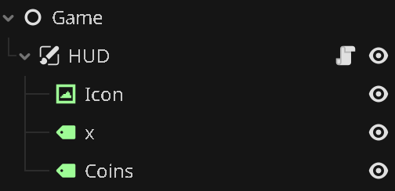
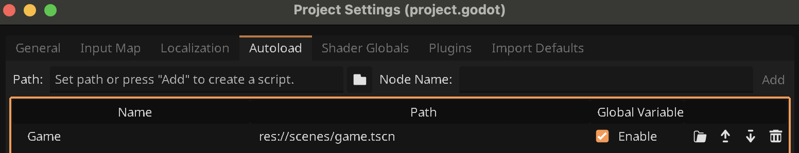
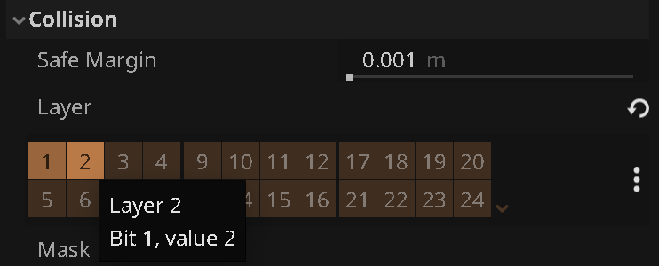
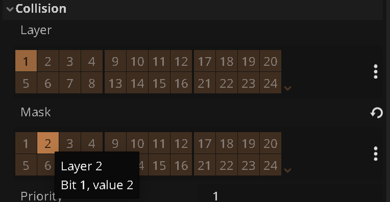

# {{ page.title }}

> This guide assumes you've already completed the guides [More Levels](more_levels.md) and [Portals](portals.md).

Currently, when we change level, the coins collected get reset to 0.

If we want to keep track of this - and potentially other things - across levels, we can use an _autoload_.

In Godot, an Autoload is a scene or script that gets loaded automatically (hence the name), and unlike regular scenes it doesn't get unloaded when changing scenes.

> For background, see the Godot docs on [Singletons (Autoload)](https://docs.godotengine.org/en/stable/tutorials/scripting/singletons_autoload.html).

In our little game, we'll add an autoload for keeping track of the number of coins collected across scenes.

* Create a new scene
* Add a `Node` as the root
* Name the root node "Game"
* Save your scene as `game.tscn`

We will now move the HUD from the individual level scenes to the Game scenes.

* Open one of your level scenes
* Select the `HUD` node
* Press `Ctrl+X` / `Cmd+X`
* Switch back to `game.tscn`
* Press `Ctrl+V` / `Cmd+V`
* Delete HUD nodes from your other level scenes

Your Game scene should now look like this:



* Select the **HUD** node
* Detach the existing script. We no longer need it

* Select the **Game** node
* Attach a new script `game.gd``
* Enter this code:

```gdscript
extends Node

var coins := 0

func collect_coin():
	coins += 1
	$HUD/Coins.text = str(coins)
```

## Autoloading game.tscn

* Open `Project Settings` from the `Project` menu
* Use the folder button to pick `game.tscn` for the path  

* Press `Add`

It should look like this now:



If you test your game now, you'll notice that the HUD appears on all levels even though you deleted the HUD from each scene. It doesn't actually count coins, though. Let's fix that.

## Fixing Coin Counting

The reason it doesn't work now is that previously we relied on `var coins` in `player.gd` and this got updated from `coin.gd` via a signla. This still happens, but since we moved the hud, it no longer listens for the coins_collected signal.

We'll do this a slightly different way now.

* Remove these two lines from `player.gd``
```gdscript
signal coin_collected
````
```gdscript
var coins = 0
```

* In `coin.gd`, change the **first part** of the `_on_body_entered` function from:

```gdscript
func _on_body_entered(body):
	if body.has_method("collect_coin") and !grabbed:
		
		body.collect_coin()
```

to this:

```gdscript
func _on_body_entered(body):
	if !grabbed:
		
		Game.collect_coin()
```

Notice that we're no longer checking if `body` has the `collect_coin` method. This was a convenient way to ensure that we're only reacting to the **Player** grabbing coins.

This means that we can now get in a situation where other bodies (like platforms) touch the coin collision shape and thereby "grab" the coins.

To prevent that, let's use **Collision Masks**:

* Open the **Player** scene
* Pick the root `Player` node
* In the `Inspector`, under `Collision` / `Layer`, add layer `2`:



* Open the **Coin** scene
* For `Collision` / `Mask`, remove `1` and add `2`:



This ensures that the coin only reacts to bodies on layer 2. Since Player is the only one that has layer 2 set, we effectively filter out everything else.

* Try your game again. Coins should now be counted correctly across levels!

