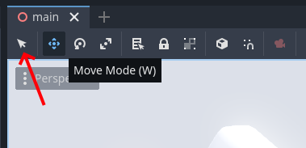

# {{ page.title }}

Next, let's try to move that coin next to the player up a bit so we have to jump to get it.

* Click the coin to select it


When selected it should look like this:


*If nothing happens, you may have accidentally pressed W without the right mouse button clicked, and changed to Move Mode. Click Q or the selection arrow to get back to Selection Mode, and try again.*



* Press ```F``` to Focus on the coin
* Click and drag the *green* arrow to move the coin upwards.  
  * Hold ```Ctrl``` to snap to whole units - *the character can jump around 1 unit, and double-jump around 2 units*
  * Hold ```Ctrl+Shift``` to snap to 0.1 units for precise positioning
* Press ```F5``` to try your change

Ok, that was fun... how about adding some more coins?

# Duplicating Stuff

* Select the coin again
* Press ```Ctrl+D``` (or ```Cmd+D``` on Mac) to Duplicate the coin

The new coin will appear exactly on top of the original coin, so until we move it we can't really see it (except in the Scene tree).

* Drag the green arrow to make the new coin appear under or over the old coin (but still in reach of the character)

Something like this:


* Try your glorious change

Ok, that's it. The game is perfect!

Right?

Ok... Maybe it can get a little bit better... Let's duplicate some more stuff!

# More and More

What we just did with the coins also works with the platforms and clouds, and *even the player* (!).

* Duplicate some different types of _platforms_
* Duplicate some more _coins_
* Duplicate some _clouds_ if the background becomes a bit too empty

Here's an example of what it can look like:

<p><video muted controls><source src="res/3d_platformer_variation.mp4" type="video/mp4"></video></p>

I'd love to see what you come up with!

# Gizmo Tips

For variation, you'll probably want to _rotate_ some of the platforms and clouds.

* Drag the ```green circle``` to rotate a selected node around it's ```Z axis```

The last thing you can do with selection manipulator (or "Gizmo" as it's sometimes called) is to drag one of the three squares.

* Drag the ```green square``` to move the selected object in the ```XZ plane```

This moves the node in the two directions orthogonal to the axis of the same color. This is slightly faster than moving along the two axes one by one.
