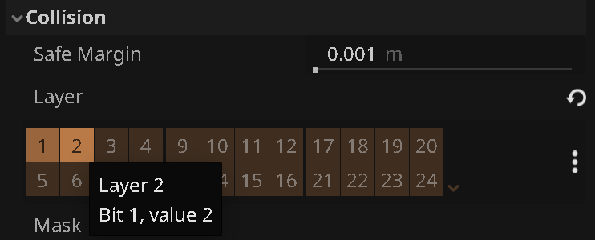
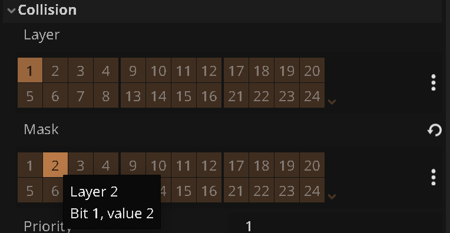

# {{ page.title }}

The Starter Kit is setup with both the player, and all other bodies on Collision Layer 1. This can cause errors and bugs, when for example platforms touch (and catch!) coins, or platform touch the flag collision shapes.

An easy way to prevent this is by using **Collision Masks**:

* Open the **Player** scene
* Pick the root `Player` node
* In the `Inspector`, under `Collision` / `Layer`, add layer `2`:

* Open the **Coin** scene
* For `Collision` / `Mask`, remove `1` and add `2`:

This ensures that the coin only reacts to bodies on layer 2. Since Player is the only one that has layer 2 set, we effectively filter out everything else.

* Repeat the process with the **Flag** scene.

Now, even if you have overlapping collision shapes, your flag and coins should *only* react to the player.
