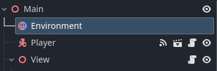
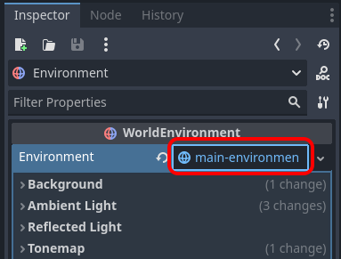
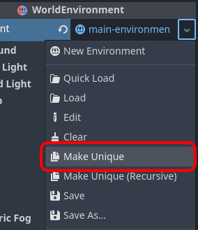
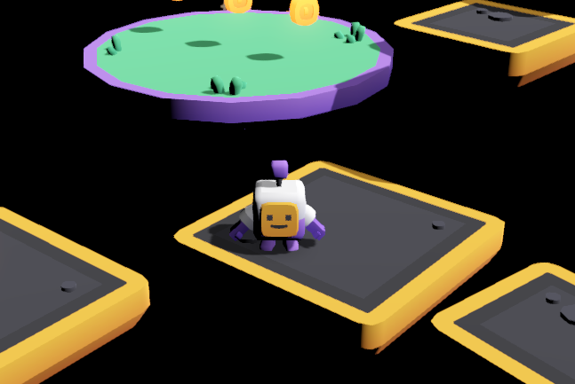
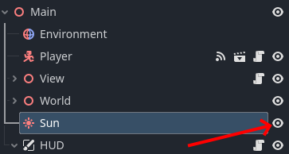
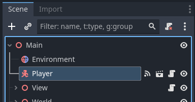
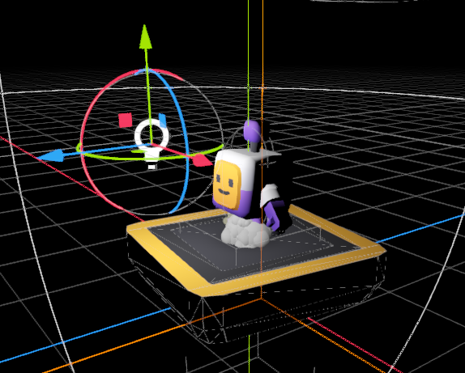
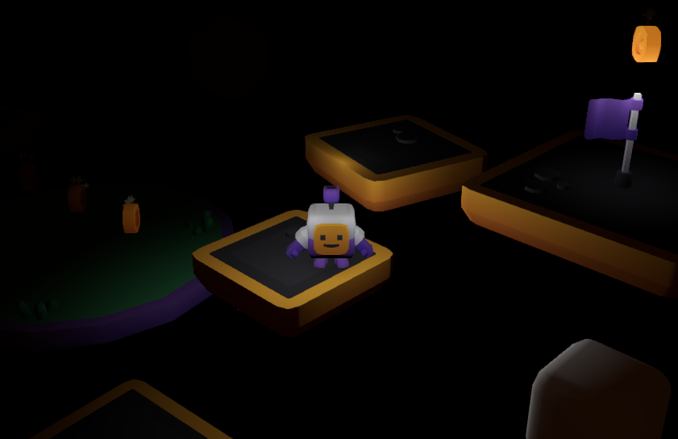

# Changing Environment

Now that we have multiple levels, and a way to move between levels, it might be interesting to have different lighting and look on some levels.

You may have noticed the  `Environment` node at the top of the scene tree. This holds the settings controlling things like the background, some lighting and effects like fog and glow.

* Select the `Environment` node

 * In the Inspector, click the `Environment` value

Now, unless you want to make your Environment changes apply to **all** your scenes, make sure it's "unlinked" first.

* Click the little down-arrow 
* Click `Make Unique`

* Change `Background`, `Mode` to `Custom Color`.
* Change `Background`, `Color` to _black_.
* Change `Ambient Light`, `Source` to `Disabled`.
* Try your changes.

It should look something like this:

All of the light that we have now is from the `Sun` directional light node.

* Click the "Eye" icon next to the `Sun` node in the Scene tree

* Try your changes

No screenshot necessary. It's pitch black, right?

Well, at night we don't really have any light from the sun, so let's try and bring some light of our own.

* Select the `Player` node in the Scene tree
* Press the Add Child Node button

* Find `OmniLight3D`
* Press `Create`

The new light will be placed at the origin of the player. That looks a little wierd, so we'll move it a bit. As if the light was just in front of the player.

* Move the light so it's in front, and slightly above the Player

* Try your changes

Notice how the light moves *with* the player. This is because we added the light as a child of the player.

* Experiment with adding more omni lights. You can add several around the player for a softer light, but you may want to turn down the `Energy` of each light to avoid over lighting the scene.

* Experiment with adding stationary lights to the scene. In this case you add the lights to the `World` node instead of the `Player`.

* Try adding back a bit of Ambient light to the Scene. Try an `Energy` of `0.1`
* Try adding Fog to the scene. Make the `Light Color` black, and `Density` `0.2`

Here's an example how this can look:

While it's tempting to add lights on the coins, be aware that many light may affect performance. Even on Gamer grade hardware!
