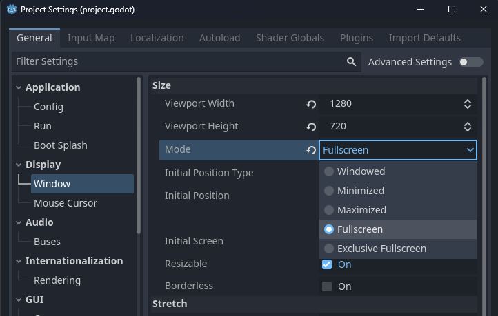

# {{ page.title }}

While testing, it's convenient to be able to still see the Godot editor window. However, for the full experience you'll probably want to make your game fill the whole screen.

There's a setting for that in Project Settings.

* Open the `Project` menu
* Click `Project Settings`
* Click `Display` > `Window` (or type "window" in the Filter Settings)
* For `Mode` choose `Fullscreen`



* Press `Close` and try your game to enjoy it *full screen*

Now, changing this option every time you switch between testing/debugging (where it's nice to still see the Godot editor) and demoing your game can get a bit tedious.

Fortunately we can fix this with a little code.

* Open the `view.gd` script. (Or, if you've already completed the [Autoload](autoload.md) guide, you can also use `game.gd`, to insure this works in *all* scenes, even those that don't have View.)

* Add the following code at the end of the existing script:

```gdscript
func _input(event):
	
	# Toggle fullsreen when pressing the F key
	
	if event is InputEventKey:
		if event.pressed and event.keycode == KEY_F:
			if DisplayServer.window_get_mode() == DisplayServer.WINDOW_MODE_FULLSCREEN:
				DisplayServer.window_set_mode(DisplayServer.WINDOW_MODE_WINDOWED)
			else:
				DisplayServer.window_set_mode(DisplayServer.WINDOW_MODE_FULLSCREEN)
```

The code adds a function to handle input (like keyboard, mouse controller), and gets called on every single input. So it's very important that we check if it's the specific input we're interested in. In our case it needs to be a key event (`InputEventKey`) and we're only interested in the case where it gets `pressed` (as opposed to released), and the keycode for the `F` key.
