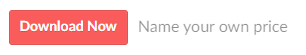
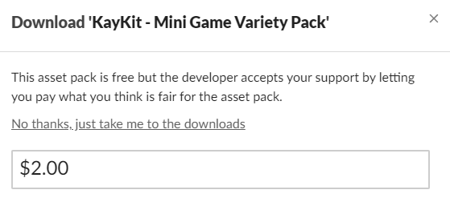
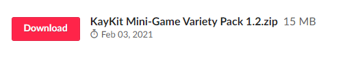
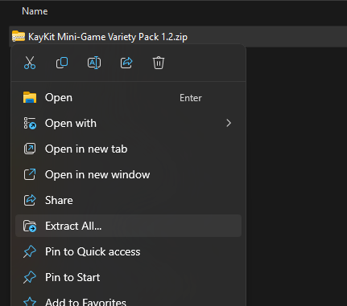
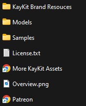
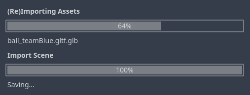

# {{ page.title }}

Ok, by now the objects that are included with the Starter Kit is starting to feel a bit limiting, and while we *can* construct simple objects (like in the [Sign](sign.md) guide) in Godot, eventually we'll find ourselves wanting for *more*.

Furtunately the internet is full of nice people that make assets we can use. Itch.io is a good place to start. Here's a link straight to [Game Assets tagged Godot and 3D](https://itch.io/game-assets/tag-3d/tag-godot).

Now, before you get too excited and try to bring in huge worlds, or models requiring skeleton animations, let's try something real simple. 

* Go to [Itch.io: KayKit - Mini Game Variety Pack](https://kaylousberg.itch.io/kay-kit-mini-game-variety-pack)

* Press the **Download Now** button

* You can press **No thanks, just take me to the downloads**, _but please consider going back here to support the creator later!_

* Press **Download** next to the zip file name

Once downloaded

* Extract the files from the ZIP file. On Windows it looks like this:

* Open the folder with the extracted files:

* Among the files you'll find:
  - Various resources from the author (KayKit in this case)
  - A folder with the actual **model** files
  - Overview and Sample images to give you some ideas of how you can use the assets
  - A *license* file - this is **really important** to understand before you distribute your glorious game

