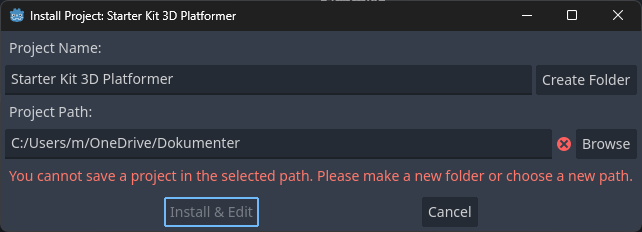
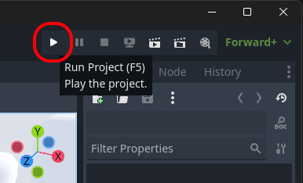
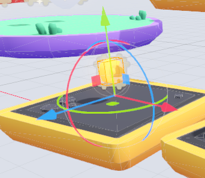

# {{ page.title }}

> Created with Godot 4.2

In this short guide you'll get started with Godot 4.2 _quickly_, using the 3D Platformer Starter Kit by Kenney.

It will look something like this:

<video muted controls><source src="3d_platformer_main.mp4" type="video/mp4"></video>

If you follow along, we'll make it _even_ cooler.

# Requirements
<!--
You don't need to have tried Godot or any other game engine before.

*It's an advantage to have tried text based programming before (like Python or JavaScript) to better understand the code examples, but it's also OK to start out just copy-pasting the examples.*

If this is your first experience with Godot, you may want check out these links first:
-->
* Read [Introduction to Godot](https://docs.godotengine.org/en/stable/getting_started/introduction/introduction_to_godot.html) 🔗 - if you are new to Godot.
* [Download & "Install" Godot](../install.md) - if you have not got it already.

# Start from a Template

We will use an awesome template from the Asset Library, made by [KenneyNL](https://kenney.nl/starter-kits) 🔗.

* Start Godot - this will show the ```Project Manager```
* Click on the the ```Asset Library Projects``` tab
* In the Search Field, type "Kenney"


* Click ```Starter Kit 3D Platformer```
* Press ```Download```



* _Optional:_ Change ```Project Path``` to where you would like your Godot projects to be stored
* _Optional:_ Change ```Project Name``` to something else
* Press ```Create Folder```
* Press ```Install & Edit```

You may get a warning like this. That's fine. Just click OK.


After a short while, the Godot Editor appears and it should look something like this:


# Try it out

* Press ```F5``` or click the ```Run project``` button to try out "your" new shiny 3D platformer game.



The game controls are:

* Move: ```W```, ```A```, ```S```, ```D``` keys
* Jump and double-jump: ```Spacebar```
* Quit: ```F8``` (or one of the platform specific ways to close an application like ```Alt+F4```, ```Cmd+Q``` etc.)

That was pretty awesome, right? Many thanks to Kenney for that!

Now, let's try and see if we can figure out what's going on here...

# The Godot Editor

If this is your first Godot experience, you may want to familiarize yourself with some of the key concepts here:

* _Optional:_ Read [Overview of Godot's key concepts](https://docs.godotengine.org/en/stable/getting_started/introduction/key_concepts_overview.html) 🔗
* _Optional:_ Read [First look at Godot's editor](https://docs.godotengine.org/en/stable/getting_started/introduction/first_look_at_the_editor.html) 🔗

For now, though, we'll focus our attention on the _3D viewport_.

# Looking Around

While the controls in the game are pretty typical, navigating the 3D viewport is a little more complex, so to get you started here's a few tips:

* ***Hold down the right mouse button*** to navigate like a typical game:
  * ```Move``` the mouse to look around
  * Use keys ```W```, ```A```, ```S```, ```D``` to move around
  * Scroll wheel to increase/decrease movement speed (or hold shift to speed up temporarily)
* Hold ```middle mouse``` button and move mouse to rotate the view
* ```Shift``` + ```middle mouse``` button to pan the view
* ```Mouse wheel``` to zoom in/out
* ```F``` key to focus selection (try this if you get lost!)

# Moving Things

Next, let's try to move that coin next to the player up a bit so we have to jump to get it.

* Click the coin to select it


When selected it should look like this:



*If nothing happens, you may have accidentally pressed W without the right mouse button clicked, and changed to Move Mode. Click Q or the selection arrow to get back to Selection Mode, and try again.*


* Press ```F``` to Focus on the coin
* Click and drag the *green* arrow to move the coin upwards.  
  * Hold ```Ctrl``` to snap to whole units - *the character can jump around 1 unit, and double-jump around 2 units*
  * Hold ```Ctrl+Shift``` to snap to 0.1 units for precise positioning
* Press ```F5``` to try your change

Ok, that was fun... how about adding some more coins?

# Duplicating Stuff

* Select the coin again
* Press ```Ctrl+D``` (or ```Cmd+D``` on Mac) to Duplicate the coin

The new coin will appear exactly on top of the original coin, so until we move it we can't really see it (except in the Scene tree).

* Drag the green arrow to make the new coin appear under or over the old coin (but still in reach of the character)

Something like this:


* Try your glorious change

Ok, that's it. The game is perfect!

Right?

Ok... Maybe it can get a little bit better... Let's duplicate some more stuff!

# More and More

What we just did with the coins also works with the platforms and clouds, and *even the player* (!).

* Duplicate some different types of _platforms_
* Duplicate some more _coins_
* Duplicate some _clouds_ if the background becomes a bit too empty

Here's an example of what it can look like:

<video muted controls><source src="3d_platformer_variation.mp4" type="video/mp4"></video>

I'd love to see what you come up with!

# Gizmo Tips

For variation, you'll probably want to _rotate_ some of the platforms and clouds.

* Drag the ```green circle``` to rotate a selected node around it's ```Z axis```

The last thing you can do with selection manipulator (or "Gizmo" as it's sometimes called) is to drag one of the three squares.

* Drag the ```green square``` to move the selected object in the ```XZ plane```

This moves the node in the two directions orthogonal to the axis of the same color. This is slightly faster than moving along the two axes one by one.

# Part 2

For more ideas and tips head on over to [Part 2](../quick_start_3d_platformer_2.md)...
