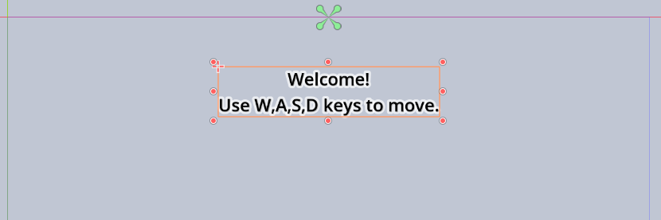
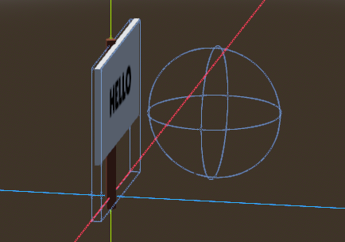
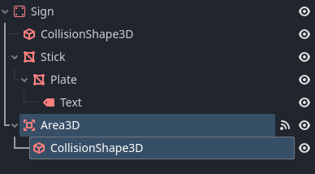
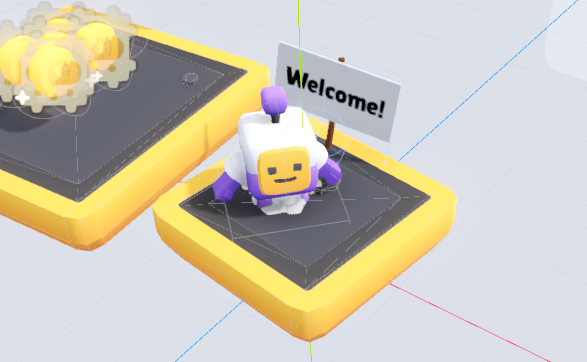
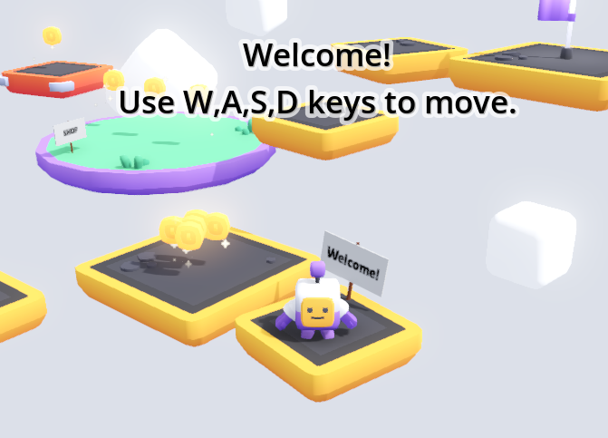

# {{ page.title }}

In this mini-guide, we'll combine the work from the [Make a Sign](sign.md) and [Make a Menu](menus.md) guides to create menus that appear when you walk up to a sign.

This creates a cool game mechanic similar to what's found in many Roblox games.

* First, [Make a Menu](menus.md) - but instead of a "Main Menu", just create a few labels with text introducing the player to the game, and maybe explain the controls



* Second, [Make a Sign](sign.md) - if you haven't already

* Open the sign scene

* Add an `Area3D` node
* Add a `CollisionShape3D` node
* Set a `New SphereShape3D` for the `Shape`
* Move and size Area3D collision shape like this:  
_**Be careful that the sphere doesn't overlap with the floor or the collision shape for your sign!** If they do, your menu will show immediately when loading the scene. Alternatively you can set [collision masks](collision_masks.md) to avoid this._



The sign scene tree should look like this now (with the new nodes selected):



* Attach this script to the `Sign` node

```gdscript
extends Node3D

## Menu to show while the player is standing in front of the sign
# We're using a PackedScene here, in the previous examples (portals 
# and menu buttons) we used a file path. Using a PackedScene is 
# slightly nicer in many ways.
@export var menu_scene: PackedScene

# Keep track of whether we're already showing the menu or not
var menu: Node = null

# When something (likely the player) enters the Area3D node
func _on_area_3d_body_entered(body):
	# If we've got a menu selected and it's not already shown
	if menu_scene and not menu:
		# Instantiate the menu
		menu = menu_scene.instantiate()

		# Add it to the SceneTree on the root node
		get_node("/root").add_child(menu)

# When something (likely the player) exits the Area3D node
func _on_area_3d_body_exited(body):
	# Free (and thus hide) the menu again
	if is_instance_valid(menu):
		menu.queue_free()
```

* Connect the `body_entered` signal to the script
* Connect the `body_exited` signal to the script

* Place a sign in your start map, near the players start position
* Rotate the sign so the collision shape is in the area where the player starts:



* Select the `Sign` node
* In the `Inspector` for `Menu Scene` use `Quick Load` to select your welcome menu scene.  
_You can also drag-drop the file from `FileSystem` onto the Inspector field_
* Test your game

The text from your "welcome menu" should show up when the player is in front of the sign, and disappear as the player leaves.


