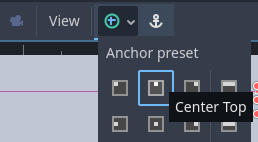
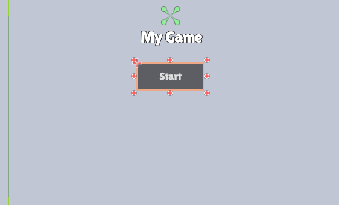
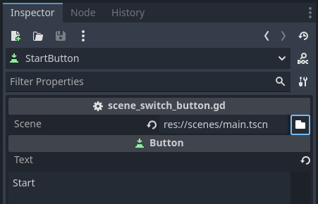
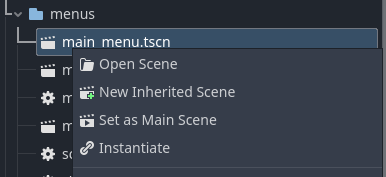
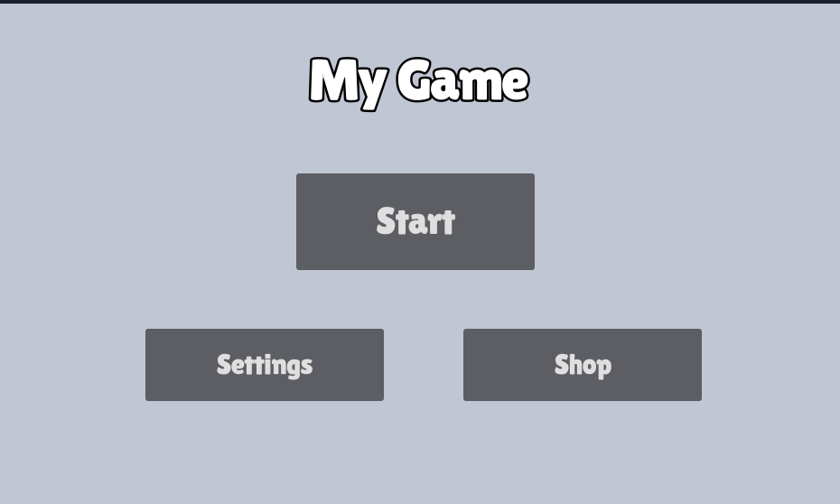

# {{ page.title }}

In this mini-guide, we'll make add a menu to our game, using Godot's User Interface (UI) facilities.

Let's get started.

* [Create a new Scene](../tips/create_a_scene.md) and [add the following nodes](../tips/add_nodes.md) (name: `Type`)
   * MainMenu: `Control`
     * Title: `Label`
     * StartButton: `Button`

* Save your scene as `main_menu.tscn`

## Adjust Title
* Select `Title`

* From the toolbar  button choose `Center Top`:



* Set `Text` to "My Game" - or whatever you'd like to call your game
* Set `Horizontal Alignment` to `Center`
* Move the Text down a bit

* Under `Control`/`Theme Overrides` adjust the look of the text to your liking.  
_For example_:

    * `Font Outline Color` = black
    * `Outline Size` = `12`
    * `Font` = `lilita_one_regular.ttf` (use `Quick Load`)
    * `Font Size` = `60`


## Adjust StartButton

* Select `StartButton`
* From the toolbar  button choose `Center Top`
* Move the StartButton down so it's below the text
* Set `Text` to "Start"
* Under `Control`/`Theme Overrides` adjust the look of the text to your liking.  
_For example_:

    * `Font` = `lilita_one_regular.ttf` (use `Quick Load`)
    * `Font Size` = `40`

## Example

This is roughly what it could look like now.



* Press F6 to try your menu scene

* Feel free to add more labels for things like author, copyright etc.

## Hooking up the Start button

* Select `StartButton`
* Add a `New Script`, but instead of the default name call it `scene_switch_button.gd`!  
_This is going to be useful for other button later!_

* Select `StartButton` again
* Select the `Node` tab
* Double-click the `pressed()` signal
* Update the script to this:

```gdscript
extends Button

# Makes a file selector available in the Inspector, and
# stores the path of the selected file in the variable "scene".
@export_file("*.tscn") var scene

# When the user presses the button of the script
func _on_pressed():
	# Change to the selected scene
	get_tree().change_scene_to_file(scene)
```

> _You may notice that this This is very similar to what we did for [flag portals](portals.md) earlier! Just simpler._

* Save the script
* Switch back to the `Inspector` tab
* Make sure you still have the `StartButton` selected
* For `Scene`, click the folder icon and find `main.tscn` (or whatever level you want to start with)



* Press F6 to try your new main menu. Clicking the Start button should load the selected scene!

* In the FileSystem tab, Right-Click on `main_menu.tscn` and choose `Set as Main Scene` to automatically load your main menu when the game starts



That's it. You have a main menu.

# Bonus: More buttons

You can duplicate `StartButton` if you want other buttons that load other levels - or even different menus.

Imagine a menu that has an overview of all the available levels.

Or a settings menu.

Or a shop menu.

You get the idea... Have fun!


