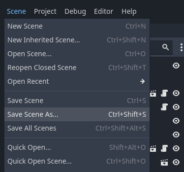
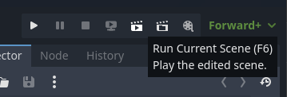
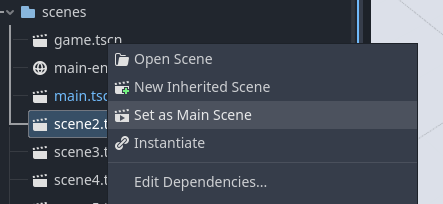

# {{ page.title }}

If you want another level, you can base it off an existing one like this:

* Switch to the scene for the level you want to duplicate
    * If it's not already open, find the corresponding file in the `FileSystem` tab, and `double-click` on it
* From the `Scene` menu, choose `Save Scene As`:

Now we have a separate file for our scene, and we can make changes without affecting the previous scene.

* Press `F6` to test the currently active scene, or use the `Run Current Scene` button:

* Or, in the `FileSystem` tab, `Right-click` on the scene file and choose `Set as Main Scene`:

This makes it the scene that is loaded when you play the game using `F5` or when you export the game.
