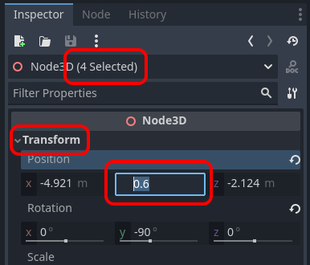

# {{ page.title }}

As your scenes become larger, moving things around individually can become rather tedious. Fortunately you have multiple ways to select multiple nodes at the same time:

* Hold `Shift` while clicking nodes in the viewport
* `Click and drag` a rectangle in the viewport
* `Shift+Click` two objects in the _Scene Tree_, to selects the nodes between the first and second click
* `Ctrl+Click` / ```Cmd+Click``` nodes in the _Scene Tree_ to select individual nodes one-by-one use

Using either of these methods, you can now manipulate multiple nodes together:

* `Move` or `Rotate` the selected object (nodes) using the manipulator (aka "Gizmo") in the viewport
* Use the `Inspector` to enter specific positions and rotations **for all of the selected nodes** at once



* Set the Y value to 0.0 (while you have multiple selected nodes)
* Press `Ctrl+Z` if you want to undo any changes you don't want to keep
