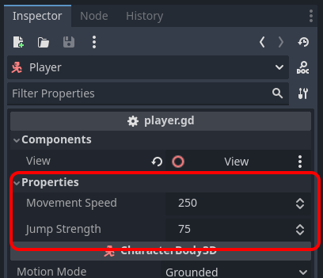

# {{ page.title }}

You can make levels where the player is faster and jumps higher, like if on a different planet.

* There are already properties on the Player node for this

Bonus idea:

* Take a look at player.gd and see if you can figure out how these properties show up here (hint: look for `@export`)
