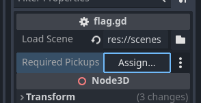

# {{ page.title }}

If you want to make it possible to continue to the next level only once all the coins have been collected, try this.

1. Update `flag.gd` to check that a specified node is empty before changing level
1. Ensure that coins get removed from the scene on pickup
1. Update levels to tell the flag what pickups are required

# 1 - Update `flag.gd`

* Open `flag.gd`
* Add the following line near the top, after the existing `@export` line

```gdscript
@export var required_pickups : Node
```

* Add the following code to the beginning of the ```_on_area_3d_body_entered``` function:

```gdscript
func _on_area_3d_body_entered(body):

	if required_pickups and not required_pickups.get_child_count() == 0:
		# Required pickups not picked up yet!
		return
    
    ... existing code
```

This adds a new property to the flag inspector that lets os select a node that needs to be empty before we can switch level.

# 2 - Ensure Coins get Removed From the Scene

Currently, coins are just hidden and disabled on pickup. We need to fix that.

* Open `coin.gd`
* Change this code:

```gdscript
		$Mesh.queue_free() # Make invisible
```
to 
```gdscript
		queue_free() # Remove from scene
```

# 3 - Update Levels

In ***each of your levels*** do the following:

* Select all **coins** in your scene  
_(hold Ctrl and/or Shift as per the [multi-select](multi_select.md) tip)_

* Right click on one of the selected coins
* Choose `Reparent to New Node`


* Choose `Node3D` this will act as simple container/folder
* Name it `RequiredPickups`

It should look something like this:


* Select the `flag` node
* Press the Assign... button



* Select the `RequiredPickups` node you just created

Try it out!

> Of course, it would be nice to tell the user why you can't move to the next level. Once you've completed the [Menu](menus.md) and [Menu Signs](menu_signs.md) guides you can use the same mechanism to display a text.
