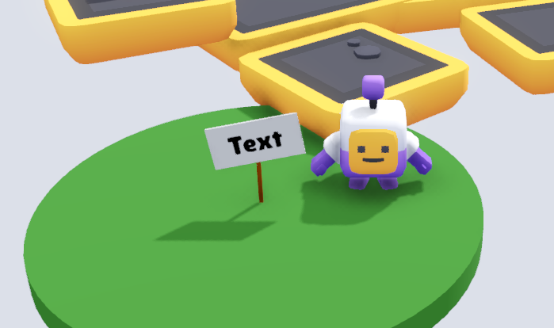
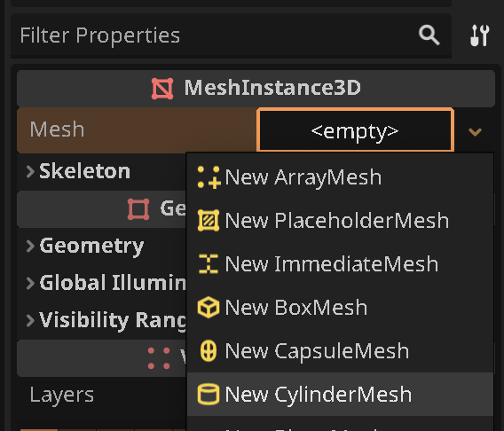
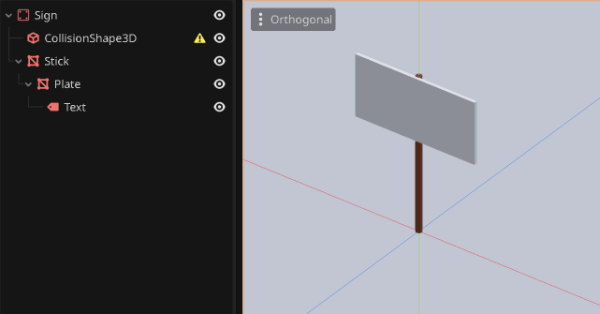
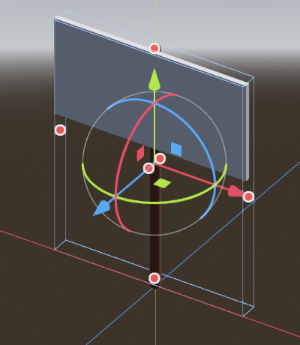
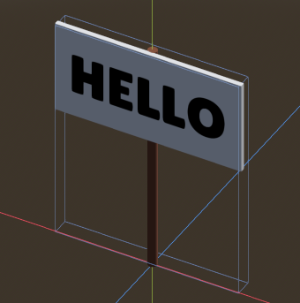
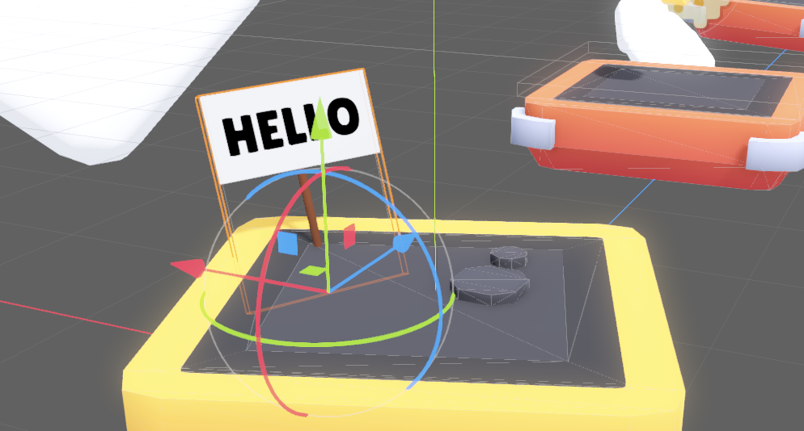

# {{ page.title }}

In this mini-guide, we'll make a little sign that you can place in your world, with any text on it!

* [Create a new Scene](../tips/create_a_scene.md) and [add the following nodes](../tips/add_nodes.md) (name: `Type`)
   * Sign: `StaticBody3D`
     * CollisionShape3D
     * Stick: `MeshInstance3D`
       * Plate: `MeshInstance3D`
         * Text: `Label3D`

* Save your new scene in the `objects` directory.  
_It should automatically get called `sign.tscn` if you named your root node "Sign" as shown above._

* Select `Stick`
* Set the `Mesh` property to `New CylinderMesh`

* Click the new cylinder mesh to edit it
* Set both `Top Radius` and `Bottom Radius` to `0.02 m`
* Set `Height` to `1 m`

Now, let's change the color of our stick:

* Set the `Material` property to `New StandardMaterial3D`
* Click the new material to edit it
* Expand `Albedo`
* Set `Color` to a brownish color (or whatever color you please)

* Move the stick up by `0.5` so the bottom of the stick sits at the scene origin

Now, let's create the Plate in a similar way:

* Select `Plate`
* Set the `Mesh` property to `New CylinderMesh`
* Set the `Size` property `x`, `y`, `z` to `0.8`, `0.4`, `0.02`
* Move Plate so it sits in a good position relative to the Stick

Your scene tree and scene should now look something like this:

Notice that our CollisionShape3D has a warning icon next to it. We'll fix that now.

* Select `CollisionShape3D`
* Set the `Shape` property to `New BoxShape3D`
* Use the size manipulators to make the box roughly the size of the sign

Ok, and now - finally - let's set the text:

* Select the `Text` node
* Expand the `Text` section in `Inspector`
* Set the `Text` property to "HELLO" or whatever you like (we'll change this again when we place instances of the sign)
* Drag the blue arrow a bit to move the text _out of the sign_ so it becomes visible

* Adjust the other text settings like colors (`Modulate`) and `Font` as you desire

Note that you can get a crisper text by making the text `Font Size` much larger, and then scaling down the node with `Transform/Scale` or by using the scale tool.

It can now look something like this:

* Save the scene again

* Now open a level scene where you would like to place your sign
* _Instance_ the sign by _dragging_ `sign.tscn` from the `FileManager` onto the desired position in the scene
* Adjust the position and rotation of the as you please

Now we just need to tweak the text.

* Right-click `Sign`
* Enable `Editable Children``
* Select the `Text` sub-node, and adjust the `Text` property

> The yellow coloring here is meant as a warning that any changes here may be lost if the source scene is changed. If you are careful to not rename any of the nodes leading up to the Text node, you should be fine.

Now, go _sign_ your levels! 😉

# Bonus Idea

Similar to what we did with [flag portals](portals.md), you can add an `Area3D` to register the player walking up to it and load another scene, a shop map or whatever you'd like.
