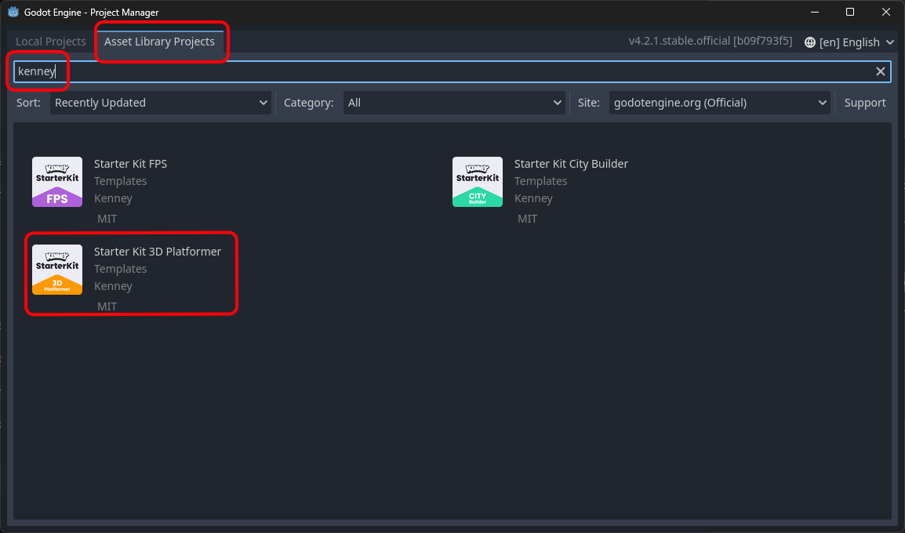
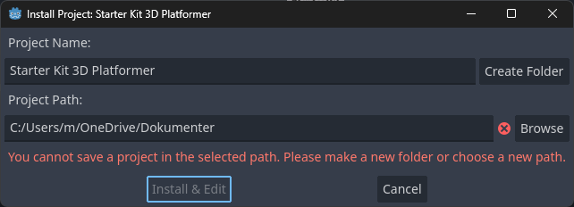
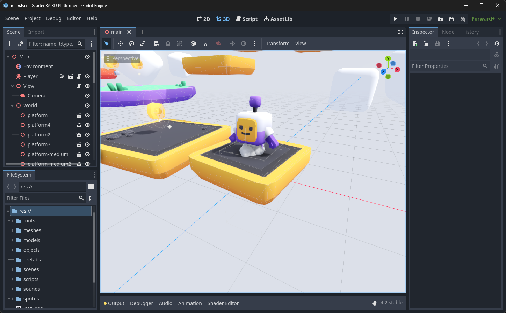

# {{ page.title }}

We will use an awesome template from the Asset Library, made by [KenneyNL](https://kenney.nl/starter-kits) 🔗.

* Start Godot - this will show the ```Project Manager```
* Click on the the ```Asset Library Projects``` tab
* In the Search Field, type "Kenney"



* Click ```Starter Kit 3D Platformer```
* Press ```Download```



* _Optional:_ Change ```Project Path``` to where you would like your Godot projects to be stored
* _Optional:_ Change ```Project Name``` to something else
* Press ```Create Folder```
* Press ```Install & Edit```

You may get a warning like this. That's fine. Just click OK.


After a short while, the Godot Editor appears and it should look something like this:



# Try it out

* Press ```F5``` or click the ```Run project``` button to try out "your" new shiny 3D platformer game.


The game controls are:

* Move: ```W```, ```A```, ```S```, ```D``` keys
* Jump and double-jump: ```Spacebar```
* Quit: ```F8``` (or one of the platform specific ways to close an application like ```Alt+F4```, ```Cmd+Q``` etc.)

That was pretty awesome, right? Many thanks to Kenney for that!

Now, let's try and see if we can figure out what's going on here...

Press back, and continue with the next step.
