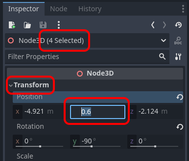

# {{ page.title }}

> Created with Godot 4.2

This guide picks up where [Part 1](quick_start_3d_platformer/index.md) left off.

# Tips

## Multi-Select

* Hold ```Shift``` while clicking nodes in the viewport to select multiple
* When you move or rotate, all of the selected object (nodes) will move or rotate together

On the right hand side, you have the ```Inspector```, which allows you to enter specific positions and rotations **for all of the selected nodes** at once.



* Set the Y value to 0.0 (while you have multiple selected nodes)
* Press ```Ctrl+Z``` if you want to undo that change

```Shift+Click``` also works for selecting multiple objects in the _Scene Tree_, but note that here it selects *all of* the nodes between the first and second click. To select individual nodes one-by-one use ```Ctrl+Click``` click instead (```Cmd+Click``` on Mac).

# Mini-guides

* [Duplicate Levels](./duplicate_levels.md)

* [Flags as Portals](flag_portals.md)

* [Moving Platforms](moving_platforms.md)

* [Environment](environment/index.md)

# Ideas

## 2 or more players that move together

* Try duplicating the player, and make some levels that require careful moves to succeed
* If just one falls down, you loose

Here's an example:


## Adjust player speed/jump power

* There are already properties on the Player node for this


Bonus idea:

* Take a look at player.gd and see if you can figure out how these properties show up here (hint: look for `@export`)


## Custom platforms ("modelled" in Godot)

You can use Mesh nodes with a corresponding Collision shape for custom platforms, Godot has build in Mesh shapes for boxes, cylinders and more. Or you can use the CSG nodes to build more advanced prototype levels, since these allow merging or subtracting individual shapes from each other.

## Auto-run to make the game a "Runner" game

Look at `player.gd`, and see if you can figure out how to make the player automatically run in one direction. Disable the steering controls, and make a level that just requires careful timing of jumps. This is a common mechanism used in mobile games.

Here's an example. Let's call it a 2½D runner or platformer:

<video controls src="3d_platformer_2d.mp4" title="2.5D Runner"></video>

Here's a variation that's also often seen in mobile games:

<video controls src="3d_platformer_runner.mp4" title="Title"></video>

