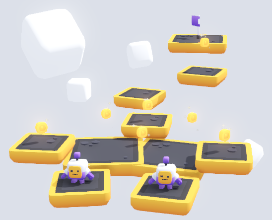

# Godot Quick Start - 3D Platformer - Part 2

This guide picks up where Part 1 left off, so if you haven't already completed Part 1, now's the time to do that.

# Tips

* Multi-select (with shift)
* Edit multiple
* Change X/Y/Z for multiple selected nodes

# Ideas

* [Duplicate Levels](./duplicate_levels.md)

## 2 or more players that move together

* Try duplicating the player, and make some levels that require careful moves to succeed
* If just one falls down, you loose

Here's an example:

## Adjust player speed/jump power

* There are already properties on the Player node for this

Bonus idea:

* Take a look at player.gd and see if you can figure out how these properties show up here (hint: look for `@export`)

## Mini-guides

* [Flags as Portals](flag_portals.md)

* [Moving Platforms](moving_platforms.md)

## Custom platforms ("modelled" in Godot)

TODO
