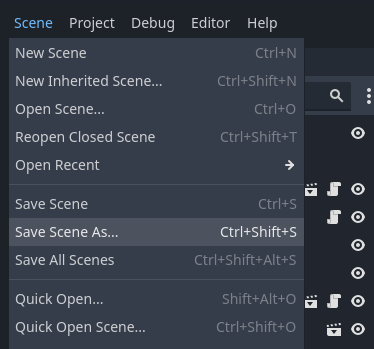
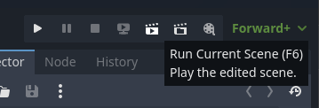
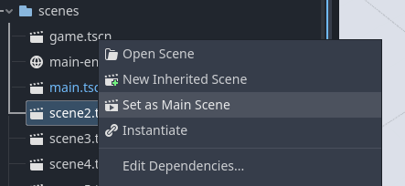
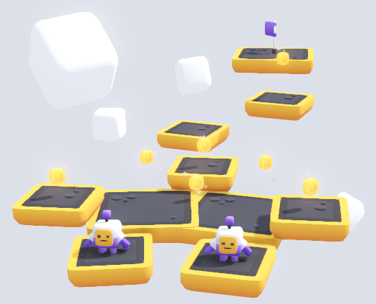
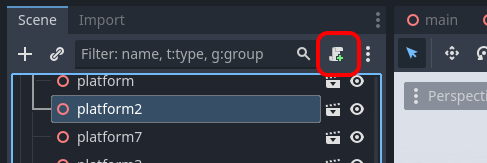

# Godot Quick Start - 3D Platformer - Part 2

This guide picks up where Part 1 left off, so if you haven't already completed Part 1, now's the time to do that.

# Tips

* Multi-select (with shift)
* Edit multiple
* Change X/Y/Z for multiple selected nodes

# Ideas

## More levels

* Scene Menu, Save Scene As



* Press F6 to test the currently active scene



* Or right-click on the scene file to make it the Main Scene



* Flags change scene (see below)

## 2 or more players that move together

* Try duplicating the player, and make some levels that require careful moves to succeed
* If just one falls down, you loose

Here's an example:



## Adjust player speed/jump power

* There are already properties on the Player node for this


Bonus idea:

* Take a look at player.gd and see if you can figure out how these properties show up here (hint: look for `@export`)

## Flag transport to other scene

* Needs a scene and script for the flag node

  * Click the `Open In Editor` icon
  * Choose `New Inherited`
  * Add an `Area3D` and a `CollisionShape3D` nodes

* Effect: Fly player up/down
* Effect: Camera looks up/down
* Sound, rotation etc.

## Custom platforms ("modelled" in Godot)

## Moving platforms

**Important**: Change the body type of *the platform* from "StaticBody3D" to "CharacterBody3D" (otherwise the platform won't move the player)

* Easy: Move using sinus (look at coin.gd for inspiration)
* Easy: Rotate around a point (coin.gd, but also move the platform away from the origin point)
* Harder: Move between two points. Either specify the two points using coordinates, or maybe use an @export var Path


# Moving platforms

* Select the platform you want to make moving
* Click the Attach Script button


![[moving_platforms1.png]]

* Update the name of the script (in Path)
* Press Create

![[moving_platform2.png]]

* Add a line `@onready var start_position = position` after `extends Node3D` like this

```gdscript
extends Node3D

@onready var start_position := position
```
