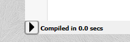

# Our First Shader

## Green Screen

- Create account on ShaderToy - so you can save your work!
- Press the `New` button

You start with a basic shader. We're going to start with an even more basic shader. Update the code to this (copy-paste the whole thing, or take just replace the middle section with the `vec3 col = vec3(0, 1, 0);` line):

```glsl
void mainImage( out vec4 fragColor, in vec2 fragCoord )
{
    vec3 col = vec3(0, 1, 0);

    fragColor = vec4(col, 1.0);
}
```

To see your changes, press the little arrow in the lower-left corner, or press `Alt+Enter`.



The preview window should now be fully green.

Congrats - green means Go! So let's go on...

> If you are new to shaders, and this type of code in particular, you'll want to read the following explaination of the code first.
>
> Fully understanding the code will help you in the next steps.

### Detailed Code Explanation

Let's look at the code line by line:

```glsl
void mainImage( out vec4 fragColor, in vec2 fragCoord )
```

- `void mainImage` defines the function that get's run for every pixel.
  - `void` means that the function doesn't return anything
  
  - `mainImage` this name let's ShaderToy know where to start. *Different systems use different names, but in ShaderToy this function **has** to be called `mainImage`.*

- `out vec4 fragColor`
  - `out` means that we can only write (assign) values to this variable.

  - `vec4` means that `fragColor` can hold exactly 4 numbers. Colors consist of 3 values (RGB - for Red, Green and Blue). This is the first 3 numbers. The fourth is not actually used by ShaderToy, but other systems may use it as the "Alpha" channel for transparency.

  - *`fragColor` can actually be any name, but on ShaderToy this is the name most typically used. (While you *can* change it, consider that probably makes it more difficult for other people to read your code).*

- `in vec2 fragCoord` this time we're dealing with an `in` argument, which means we should only **read** from this. ´vec2´ indicate that fragCoord contains two numbers. Specifically `x` and `y` indicating the position in the view that the shader is about to draw to.

This is where the magic happens... All you have to do is to answer the question: *For the pixel at coordinate `fragCoord` what color should I draw?* Simple, right?

```glsl
{
```
This is a *curly brace*, and if you've used languages like C, Java, JavaScript, CSS or similar you may already be familiar with them.

It means that the *content* of the mainImage function starts here, and continues until we reach a matching `}`.

```glsl
    vec3 col = vec3(0, 1, 0);
````

This time we're creating our own variable of type `vec3` (three numbers) and putting the three numbers 0, 1 and 0 into it. 

`col` is short for color, but this is our own name and feel free to spell out `color` instead. Just make sure to update it on the following line also.

Since we're going to use this variable for a color, we can think of the vec3 as containing Red, Green, and Blue values (we'll use this a lot and just call it RGB). Each value has to be between 0.0 and 1.0. Anything higher or lower won't have any effect.

> Try playing with different numbers, and see if you can make the screen your favorite color.

`;` very important - lines like this *must* end with a semicolon `;`. If you get wierd errors, double check that you haven't missed this on the line *before* the error.

Generally speaking, unless you have code that will be followed by `{`, you'll need to add a `;` to end the *statement*.

```glsl
    fragColor = vec4(col, 1.0);
```

Here we tell the shader the answer by *assigning* (`=`) the color we've decided on to the `out` argument in `fragColor`.

Another way to write this would be 
`fragColor = vec4(col.r, col.g, col.b, 1.0);` but the shader language automatically expands `vec` types into their individual parts as needed.

```glsl
}
```
This is the closing curly brace, and signal that we're done with our `mainImage` function!


## Variation (color by fragCoord.x)

Vary color by coordinate.


## Screen Coordinates (iResolution)

Dividing by screen resolution gets annoying. iResolution to the rescue!

## The Time Factor (Animation!)

iTime gets in the mix.

## Time Loops (sin FTW!)

fract and sin for repeating time.

geogebra

## More Colors

Vary R, G and B simultaneously


# Lesson 2


# Final code

```glsl
void mainImage( out vec4 fragColor, in vec2 fragCoord )
{
    vec2 uv = vec2(fragCoord / iResolution.xy);

    vec3 color = vec3(
        sin(iTime * 1.0 )/2.0 + 0.5,
        sin(iTime * 2.0 )/2.0 + 0.5,
        sin(iTime * 3.0 )/2.0 + 0.5
        );
 
    fragColor = vec4(color,1.0);
}
```
