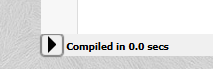
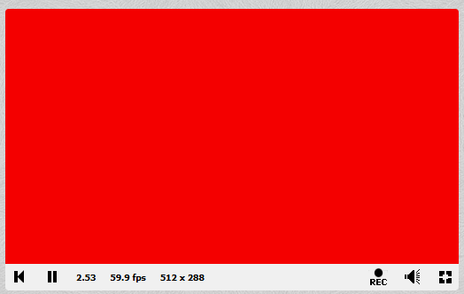

# {{ page.title }}

In ShaderToy, we write code for `Fragment Shaders`.

A **fragment shader** is a small program that gets runs once **per pixel** to decide that pixel’s color — massively in parallel on the GPU.

> For each pixel, the GPU asks the shader:
> > *what color should I be?*
>
> The shader answers using math.
>
> In ShaderToy the main function is called `mainImage`, and it receives an input `fragCoord` to indicate what current pixel coordinate in screen pixels (x,y) it's going to color.
>
> The color should be written (assigned) to the `fragColor` variable.

## Our first shader

1. Click **New** at the top-right corner.
2. Update the code to the following:

```glsl
void mainImage(out vec4 fragColor, in vec2 fragCoord) {
    fragColor = vec4(1.0, 0.0, 0.0, 1.0); // solid red
}
```

To see your changes, press the little arrow in the lower-left corner, or press `Alt+Enter`.


It should now look like this:



<!--<p><iframe width="640" height="360" frameborder="0" src="https://www.shadertoy.com/embed/wfBcDD" allowfullscreen></iframe></p>-->

Very red, but not very exciting yet. Let's keep going...

### Further reading
- [The Book of Shaders](https://thebookofshaders.com/)
- [GLSL fragment shader basics](https://www.khronos.org/opengl/wiki/Fragment_Shader)

[Next: Part 1 — Normalize coordinates](part01_normalize_coordinates.md)
