# {{ page.title }}

I denne vejledning vil i komme til at lave en lille 3D scene, med kugler der falder ned og overholder fysikkens regler.

I vejledningen er de enkelte ting man skal gøre, opstillet som disse:

* Gør dit
* Gør dat

Øvrig tekst forklarer nærmere hvad det er vi gør, og skærm billeder er tænkt som en hjælp til at følge med.

Lad os nu komme igang!

# Start Unity

* Installer Unity seneste version. *Hvis altså ikke du allerede har det.*
  * Gå til [unity.com/download](https://unity.com/download) og følg vejledningen der.

I denne Tutorial bruger jeg version 2022.2. Der kan være forskelle hvis du bruger en anden version.

# Lav et nyt Unity projekt

* Start Unity Hub  
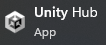

* Vælg New Project

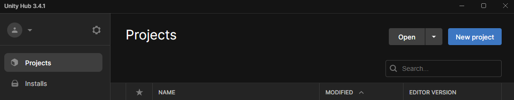

* _Hvis du har flere versioner af Unity Editoren installeret, så sørg for at vælge den du vil bruge fra listen i toppen:_

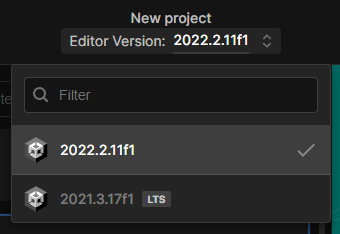

* Vælg Core og 3D

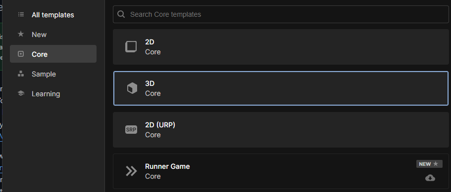

* Under Project Settings, find på et godt navn til dit projekt, jeg har kaldt mit Balls2022.
* Under Location kan du trykke på mappe ikonet  og vælge et sted på din harddisk du kan finde igen.

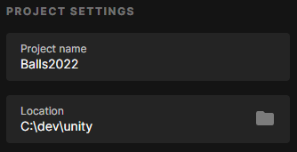

* Tryk **Create Project**  
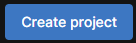

* Vent, mens Unity gør dit projekt klar. Det tager lidt tid...

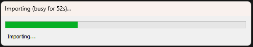

Du skulle nu gerne være i Unity's hoved vindue, og du er klar til at gå igang med Trin 1.

# Trin 1 - Byg en scene

* Tilføj en Sphere (kugle)
* Tryk på  ikonet under Hierarchy.

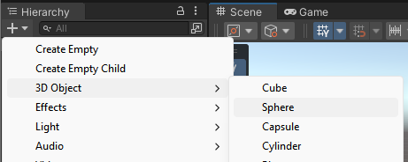

* Vælg 3D Object, Sphere.

Din nye Sphere kan nu ses både i *Hierarchy*, visuelt under *Scene*, og du kan se dens forskellige indstillinger under *Inspector* i højre side af Unity

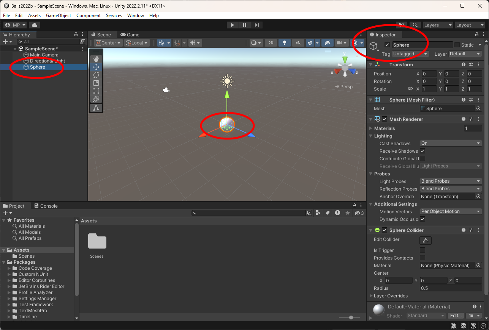

* Under Transform, sørg for at Position X, Y og Z står til ca. 0, 2 og 0 som her:

Du kan enten taste tallene ind, eller du kan hive i de farvede pile der vises:

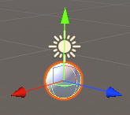

TIP: Hvis du holder Ctrl nede mens du trækker i pilene, vil de "snappe" til "pæne" tal.

* Tilføj et Plane, som du før tilføjede en Sphere (dvs. tryk plus under Hierarchy, vælg 3D Object, Plane.)
* Sæt Position X, Y og Z til 0, -2 og 0
* Klik på "Main Camera" i Hierarchy. Du får herved et preview der gerne skulle se ud som dette:

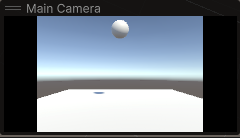

* Prøv at trykke Play , øverst i Unity vinduet:

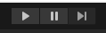

Du skulle gerne det samme som i preview for Main Camera, blot større!

* Tryk på Play igen for at slutte afspilningen, og komme tilbage til editering.  
  **Bemærk at hvis man hopper tilbage i Scene uden at stoppe afspilning vil ens ændringer ikke blive gemt!!**  
  Det er til gengæld en meget nem måde lige at lave små eksperimenter.

# Trin 2 - Bevægelse

Vores scene er lidt kedelig når der ikke sker noget, så lad os prøve at få kuglen til at falde ned.

* Vælg din Sphere under Hierarchy

* Vælg **Add Component** i bunden af Inspector

* Vælg Rigidbody. Du kan evt begynde at taste navnet "Rigidbody" ind for at finde den hurtigere.

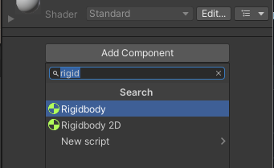

* Tryk Play igen, og se hvordan din Sphere falder ned på Plane med et brag... Nej, ok braget må du tænke dig til, indtil der bliver tilføjet lydeffekter 😁 

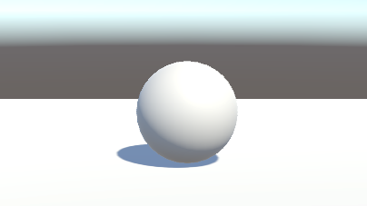

* Tryk Play igen for at stoppe afspilning.

# Trin 3 - Mere gang i den

Ok, det er stadig lidt kedeligt. Lad os tilføje nogle flere Spheres.

* Vælg din Sphere under Hierarchy
* Tryk Ctrl+D for at duplikere (eller højreklik, og vælg Duplicate)
* Flyt den nye Sphere lidt, så den ikke ligger præcis oven i den anden.
* Dupliker og flyt en eller flere yderligere Spheres, og prøv at placere dem så det giver en fed effekt når du afspiller.

<video muted controls><source src="res/wip1.mp4" type="video/mp4"></video>

_Bemærk at duplikering af objekter på denne måde ikke er den bedste måde at lave mange ens objekter på. Her vil man i stedet normalt bruge **Prefabs**, men det vender vi tilbage til i en senere vejledning._

# Trin 4 - Sluk lyset!

Lad os prøve at gøre lyset i scenen lidt mere spændende. Som standard starter projektet med en enkelt "Directional Light" lyskilde. Den svarer lidt til hvordan lyset kommer fra solen, og belyser hele scenen jævnt fra en bestemt retning. Derudover er der lidt baggrundslys fra det Environment der er også er sat som standard.

Lad os slå begge dele fra, så vi "slukker lyset" helt.

* Vælg *Directional Light* under *Hierarchy*
* Under *Inspector*, fjern hakket til venstre for navnet.

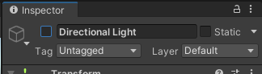

* Gå ind i menuen *Window, Rendering, Lighting*

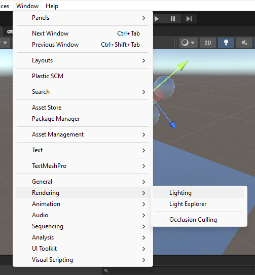

* Tryk på *Environment*

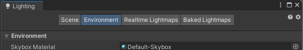

* Tryk på den lille cirkel med en prik 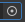, til højre for *Skybox Material*

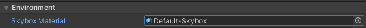

* Vælg Material "None".

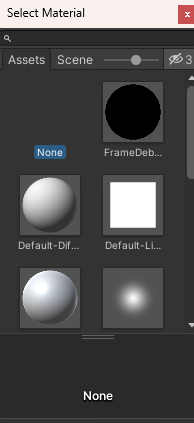

* Sæt Environment Lighting, *Source* til *Color*
* Sæt Environment Lighting, *Ambient Color* til helt sort

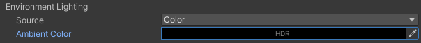

* Tryk på krydset i for at lukke Lighting vinduet

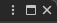

* Klik på *Main Camera* under Hierarchy
* I Inspector, Camera, *Clear Flags* vælg *Solid Color*
* Sæt *Background Color* til helt sort

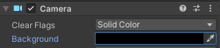

Prøv at afspille scenen nu. Det skulle gerne være **helt sort** nat nu.

# Trin 5 - Nyt lys

* Under Hierarchy, Plus knappen, Light, vælg *Spot Light*
* Brug de farvede pile til at placere dit nye Spot light så det oplyser stedet hvor kuglerne falder ned.
* Skift til at rotere, og træk i de farvede buer for at dreje lyset. Det ser som regel bedst ud hvis lyset kommer lidt fra siden, og bag kameraet. Men prøv dig frem til noget du synes ser fedt ud!

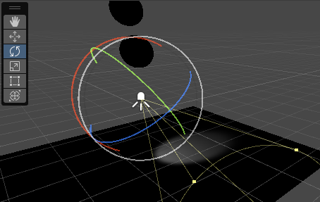

***Tip**: Du kan bruge genvejs tasterne Q,W,E,R,T,Y til at skifte mellem de 6 forskellige værktøjer i menuen. Så tryk fx E for at skifte til Rotér, og W for at komme tilbage til flyt.*

* Øg evt *Range* og *Spot Angle* i Inspector under Light

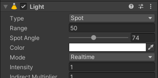

* Under Light, Shadow Type, vælg **Soft Shadows**

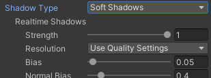

Du kan også justere lidt på placeringen af **Main Camera**

Kameraets **Field of View** indstilling kan bruges til at "zoome". 50 grader er som regel det der ser mest naturligt ud, men her kan en mindre Field of View godt bruges.

Fortsæt med at justere lys og kamera indtil du er tilfreds. Det kan for eksempel se sådan her ud:

* For dit Spot Light, sæt Color til ren rød:  
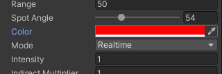

* Lav en kopi af dit spot light (tryk Ctrl+D)
* Flyt kopien en anelse til højre
* Ændr farven til ren grøn
* Lav en kopi mere, flyt den lidt og lav den blå

Det burde se ud i stil med dette:

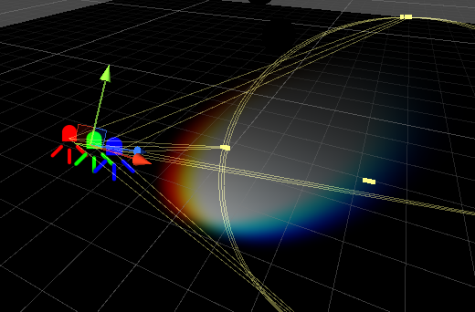

Bemærk at der hvor alle tre lys rammer, er der normalt hvidt lys.

Når du afspiller scenen får man nogle fede farvede skygger, og kuglerne skifter farve når de bevæger sig gennem de forskellige lyskilder.

Min version kom til at se sådan her ud, men jeg glæder mig til at se jeres!

<video muted controls><source src="res/part1_done.mp4" type="video/mp4"></video>

Prøv gerne at tilføje flere planes, kugler og andre former!

I næste vejledning [Lys og Kugler 2](../lights_and_balls2/index.md) bygger vi videre på det vi har lavet her, og tilføjer kode så det begynder at føles lidt som et spil.
