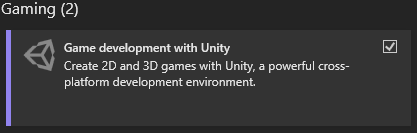
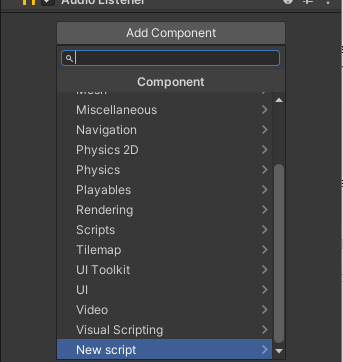
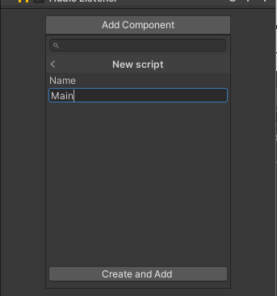
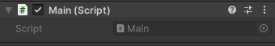
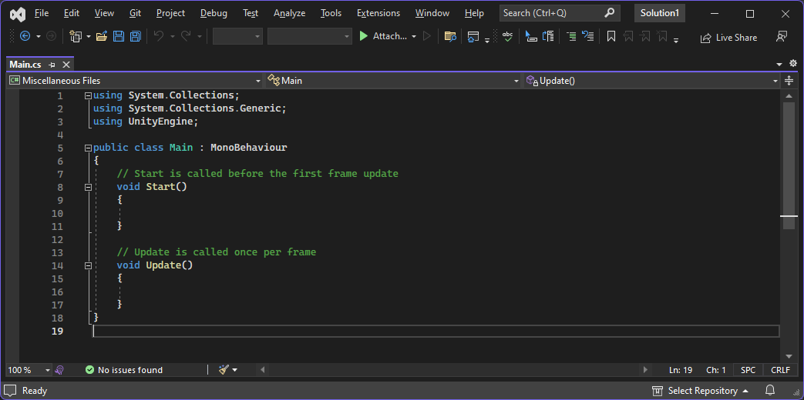
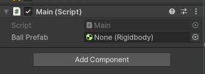
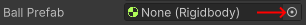
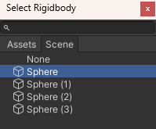
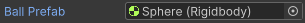
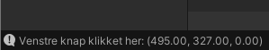

# {{ page.title }}

Denne vejledning bygger videre på [[Lys og Kugler 1]], som du derfor skal have lavet først.

Vi gør vi vores scene interaktiv, så man selv kan tilføje flere kugler når man klikker med musen, og det begynder at føles lidt som et spil.

# Installer Visual Studio

I Unity koder man interaktivitet og anden opførsel med C# (udtales "see sharp"), som er et programmerings sprog Microsoft har lavet, og som bruges i alle mulige sammenhæng.

For at kunne redigere i C# koden skal vi have installeret Microsoft's Visual Studio.

* Download Visual Studio 2022 Community Edition fra https://visualstudio.microsoft.com/
* I installationen, skal du sørge for at der er hak ud for Game development with Unity  


* Hvis du vil bruge Visual Studio i mere end 30 dage, skal du logge på med en Microsoft konto.  
*Hvis du allerede har en fra Windows, Office eller Minecraft kan du bruge den.*

# Trin 1 - Tilføj et Script

Man kan tilføje scripts til alle spil objekter i Unity, og det virker på samme måde som vi brugte "Add Component" tidligere.

Hvilket objekt man tilføjer scripts til afhænger lidt af hvad det er man vil lave, men her har jeg valgt at tilføje opførslen til vores kamera (Main Camera), da det er det eneste objekt vi har præcist ét af, og da vi i øvrigt også skal bruge kameraet til at finde ud af hvor de nye kugler skal komme fra. 

* Vælg *Main Camera* i Hierarchy
* Tryk *Add Component* i bunden af Inspector
* Vælg "New script" i bunden af listen (eller brug søge feltet til at søge efter "script")  


* I Name, erstat "NewBehaviourScript" med navnet "Main"   


* Tryk *Create and Edit* for at oprette det nye script
* Dobbelt-klik på *Main* ud for Script for at åbne scriptet i Visual Studio.  



Visual Studio skulle gerne starte, og se ud i stil med dette:  
  
*Farver og opsætning kan være forskellig på din computer.*

Koden er forudfyldt med to *funktioner*: **Start** og **Update**. Teksten markeret med grøn er kommentarer, der forklarer hvad de to funktioner bruges til.

# Trin 2 - Tilføj en public variabel

I første omgang har vi brug for at få fortalt koden hvilket spil objekt vi gerne vil "skyde" med.
Det kan vi gøre ved at tilføje en **public** variabel. Alle variable markeret med public bliver synlige og kan tilpasses fra Unity editoren.

* Tilføj den farvede linie herunder, så det står mellem det kode der allerede findes, og som er markeret **uden** farve her:  
```
public class Main : MonoBehaviour
{
```  
```csharp
    public Rigidbody ballPrefab;
```  
```
    // Start is called before the first frame update
    void Start()
    {
    
    }
```

* Gem dine ændringer. Tryk Ctrl+S (Cmd+S på Mac) for at gemme.
* Gå tilbage tilbage i Unity (Alt+Tab)

# Trin 3 - Tildel objekt til variabel

* Vælg **Main Camera** igen i Hierarchy.
* I Inspector, under **Main (Script)** skulle du nu gerne have et nyt felt **Ball Prefab** som svarer til den linje med ```ballPrefab``` vi lige tilføjede i scriptet.  

  
  
* Tryk på den lille cirkel med prik i midten, længst til højre for **Ball Prefab**  
  

* Dobbelt-klik på det første Sphere objekt  
  

Det skulle gerne se sådan her ud nu:  
  

# Trin 4 - Reager på klik

Vi vil gerne have vores kode til at gøre noget når vi klikker på skærmen.

* Indsæt kode der tjekker Input.GetMouseButtonUp i Update metoden. Lige som før, så er det nye kode markeret med farve:  
```
    void Update()
    {
```  
```csharp
        if (Input.GetMouseButtonUp(0))
        {
           Debug.Log("Venstre knap klikket her: " + Input.mousePosition);
        }
```
```
    }
```

Du kan læse mere om de Unity ting vi bruger her, hvis du har lyst:

  [Input.mousePosition](https://docs.unity3d.com/ScriptReference/Input-mousePosition.html)  
  [Input.GetMouseButtonUp](https://docs.unity3d.com/ScriptReference/Input.GetMouseButtonUp.html)

Det der sker her er dog at vi tjekker med ```if (...)```  om noget er sandt.

Her tjekker vi med ```Input.GetMouseButtonUp``` om *venstre* musetast netop er blevet sluppet.

Når det bliver sker, bliver koden i mellem den krøllede start { og slut } parantes udført.

I første omgang vælger vi blot at skrive ud til "debug loggen" at der er blevet trykket på venstre musetast.
* Tryk **Ctrl+S** for at gemme dine ændringer i Visual Studio
* Tryk **Alt+Tab** for at komme tilbage til Unity
* Tryk på **Play** knappen (eller Ctrl+P) for at starte dit "spil"
* Klik et sted på dit spil, og bemærk at der helt nede til venstre i Unity vinduet står den besked vi netop har lavet i koden:  


Du kan se alle beskeder, samt flere detaljer hvis du går ind under **Console** som vist her.isual Studio

* Bemærk  hvordan tallene skifter afhængigt af hvor i spil området du trykker.
  
*(0,0,0) er nederst til venstre, og de to første tal - x og y - bliver større når man går henholdsvis til højre og opad.*

Disse tal er helt anderledes end de tal vi brugte for **Position** da vi placerede vores objekter til at starte med. Så vi får brug for en måde at omregne på. Hvis man søger på nettet efter noget i stil med "**unity screen to world position**" finder man frem til at der er en funktion der hedder hedder ScreenToWorldPoint. Den skal vi bruge om lidt...

# Trin 5 - Tilføj kugler

* Ændr Update funktionen så den kommer til at se ud som herunder.
  Linjerne der begynder med // er kommentarer. De er der for at forklare hvad koden gør og skal bruges til. Det er god kode-stil at have *gode* kommentarer i sin kode, men de er ikke nødvendige for at koden virker.

```
void Update()
{
    if (Input.GetMouseButtonUp(0))
    {
```
```csharp
        // Vi bruger funktionen ScreenPointToRay på det nuværende hovedkamera
        // for at få en ray (stråle) i "verdens" koordinater ud fra musens
        // skærm koordinater.
        Ray ray = Camera.main.ScreenPointToRay(Input.mousePosition);

        // Med vektor-regning flyttes position lidt væk fra kameraet, så 
        // vores nye kugle ikke starter for tæt på.
        // Prøv evt. at ændre tallet og se hvad der sker.
        // f'et er nødvendigt for at lave tallet til et såkaldt "float".
        Vector3 position = ray.origin + ray.direction * 2.0f;

        // Tilføj en ny kugle på den beregnede position. Quaternion.identity
        // bestemmer hvordan den er roteret i rummet.
        // For en kugle gør det naturligvis ingen forskel.
        Instantiate(ballPrefab, position, Quaternion.identity);
```
```
    }
}
```

Du kan læse mere om de Unity ting vi bruger her:

  [Input.mousePosition](https://docs.unity3d.com/ScriptReference/Input-mousePosition.html)  
  [Camera.ScreenPointToRay](https://docs.unity3d.com/ScriptReference/Camera.ScreenPointToRay.html)  
  [Object.Instantiate](https://docs.unity3d.com/ScriptReference/Object.Instantiate.html)

* Kør dit spil igen
* Klik på skærmen og bemærk hvordan nye kugler dukker op ud for der hvor du klikker.
* Hvis kuglerne forsvinder med det samme:
    * Prøv at ændre lidt på hvordan dine **Plane** objekter vender. Prøv at vend dem så de hælder lidt *væk* fra kameraet. Så skulle kuglerne gerne rulle "ind" i skærmen.
* Hvis du slet ikke kan se kuglerne, eller hvis de ikke rammer dit plane:
    * Prøve at gøre tallet `2.0f` større, så kuglerne starter længere fra kameraet.

I min version ser det sådan her ud:

<p><video muted controls><source src="res/227655876.mp4" type="video/mp4"></video></p>


# Trin 6 - Fart på

Vores nye kugler er måske lidt sløve i det. Lad os give dem et "skub".
* Opdatér din Update funktion som vist her. Det er igen den miderste, farvede, del du skal koncentrere dig om.
* Bemærk at vi **ændrer** linien med Instantiate lidt. Denne gang holder vi fat i den nye kugle i en ny variabel "body", så vi kan gøre noget mere med den.


```
            Vector3 position = ray.origin + ray.direction * 2.0f;

            // Tilføj en ny kugle på den beregnede position. Quaternion.identity
            // bestemmer hvordan den er roteret i rummet.
            // For en kugle gør det naturligvis ingen forskel.
```
```csharp
            Rigidbody body = Instantiate(ballPrefab, position, Quaternion.identity);

            // Sæt en fart i retning af strålen fra kameraet.
            // Tallet 15.0 passer til min scene, men du kan prøve dig frem hvad du 
            // synes der ser godt ud i dit spil!
            body.velocity = ray.direction * 15.0f;
```
```
        }
    }
```

Der er flere ting vi kan prøve at ændre. Prøv fx at øge "mass" (dvs. hvor tung kuglen du skyder med er):
* Sæt body.mass til 10.0  
```csharp
            body.mass = 10.0f;
```

I mit eksempel ser det sådan her ud:

<p><video muted controls><source src="res/227655847.mp4" type="video/mp4"></video></p>

Jeg glæder mig til at se hvordan jeres er kommet til at se ud!
